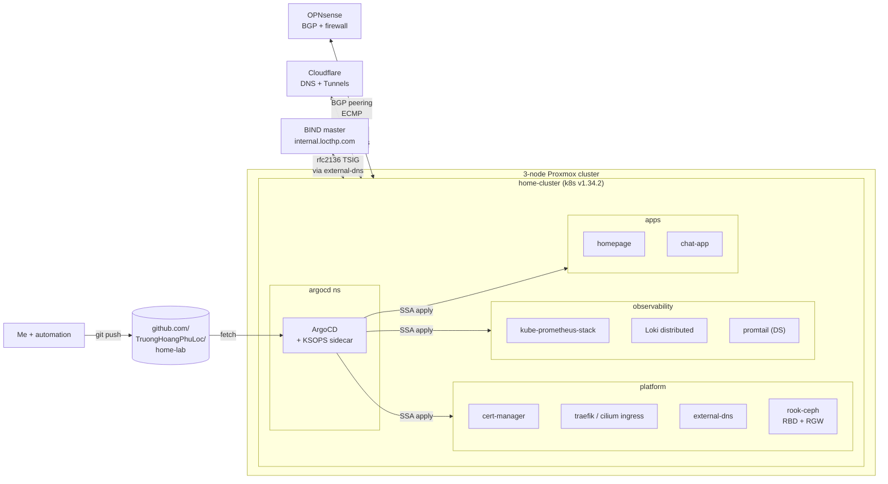

# home-lab

A bare-metal Kubernetes platform built on Proxmox VMs, fully GitOps-managed via ArgoCD, with the surrounding network, observability, and storage layers I needed to make it feel like a "real" cluster. Everything in this repo — from the BIND zone files to the Loki helm overrides to the SOPS-encrypted Cloudflare token — is what's actually running in `home-cluster`.

The point isn't just to host services for myself; it's to keep an environment where I can practice the kinds of decisions and trade-offs that come up at work, with stakes I can actually reason about.

## What's running today

```
home-cluster (Kubernetes v1.34.2)
  3 × control-plane VMs   ──┐
  3 × worker VMs           ─┴── on Proxmox 3-node cluster

Networking
  Cilium 1.18              CNI + BGP + LB IPAM (no kube-proxy)
  BGP peering              cilium agents ↔ OPNsense edge router (ECMP, dampening tuned)
  external-dns             rfc2136 → BIND master, syncing private zone records
  Traefik 3.6              cluster ingress (LB IP 172.16.180.1)
  Cilium Gateway           secondary ingress for argocd / dashboards (LB IP 172.16.180.2)

Storage
  Rook-Ceph 1.19           3 OSDs across 3 hosts, replicated size 3, host failure-domain
  ceph-block (RBD)         default StorageClass; backs every PVC (~32 GiB used / 351 avail)
  ceph-objectstore (RGW)   S3-compatible API for object workloads (Loki today; tfstate next)

Observability
  kube-prometheus-stack    Prometheus / Alertmanager / Grafana with etcd scraping
  Loki (distributed)       on Ceph S3, single-bucket pattern, 7d retention
  Promtail                 DaemonSet shipping container logs to Loki

Security / GitOps
  ArgoCD v3.3.8            7 Applications, all auto-prune + auto-selfHeal
  cert-manager + Cloudflare DNS-01      every public-facing service has a Let's Encrypt cert
  SOPS + age + KSOPS       secrets encrypted in git, decrypted at render time inside repo-server

Edge / external
  OPNsense                 firewall, BGP, VLAN segmentation
  Cloudflare Tunnels       expose select services without opening inbound ports
  Pi-hole + master/slave   private DNS for *.internal.locthp.com
```

## Architecture at a glance



## Repository layout

```
apps/                Workloads I've deployed (homepage, chat-app, ...)
platform/            Cluster platform — fully ArgoCD-managed
  argocd/            ArgoCD itself (helm-managed exception) + ARCHITECTURE.md, BOOTSTRAP.md, LESSONS.md
  cert-manager/      cert-manager + letsencrypt-prod ClusterIssuer + Cloudflare DNS-01 secret
  networking/
    external-dns/    rfc2136 to BIND
    ingress/traefik/ Traefik 3.x ingress controller
    cilium/          CNI overrides (helm-managed exception)
  observability/
    agents/promtail/ log shipper
    logging/loki/    Loki distributed mode on Ceph S3 + ARCHITECTURE.md
    monitoring/kube-prometheus-stack/  Prometheus stack with etcd cert bootstrap
  storage/rook-ceph/ Block + object storage + ARCHITECTURE.md, README.md
infrastructure/      Bare-metal layer — Proxmox terraform, OPNsense, BIND, HAProxy, kubeadm scripts
automation/          Ansible (inventory/playbooks/templates) + Jenkins CI/CD
```

Anything under `platform/` follows a strict pattern documented in [`platform/CLAUDE.md`](./platform/CLAUDE.md): a single directory per component containing `application.yaml` + `kustomization.yaml` (with `helmCharts:`) + `values.yaml` + optional `secret.enc.yaml` + `ksops.yaml`. Helm charts are pulled from upstream at render time — **no vendored charts**. The four explicit exceptions (cilium, rook-ceph, ArgoCD itself, ingress-nginx) are listed and justified there.

## Design highlights

A few of the decisions I'm proud of, with the trade-offs that drove them. Linked to the documents that capture the full reasoning.

| Decision | What it is | Why |
|---|---|---|
| **Kustomize-wraps-Helm + KSOPS** | Each component renders via `kustomize build --enable-helm` with KSOPS as a kustomize generator that decrypts `secret.enc.yaml` at render time | Lets me keep upstream helm charts out of the repo while still committing every override + every secret. Decryption happens inside the `argocd-repo-server` pod, never on disk on a node. See [`platform/argocd/ARCHITECTURE.md`](./platform/argocd/ARCHITECTURE.md). |
| **Loki on Ceph RGW with one-bucket pattern** | Single ObjectBucketClaim, single S3 bucket, internal path-prefixing for chunks/index/rules | Rook OBCs create one user per bucket, but Loki only has one S3 client config — three OBCs would mean three un-injectable credential triples. Path-prefixing inside one bucket is what Loki does internally anyway. See [`platform/observability/logging/loki/ARCHITECTURE.md`](./platform/observability/logging/loki/ARCHITECTURE.md) §6. |
| **Bucket-name resolved at runtime** | `loki.storage.bucketNames.{chunks,ruler,admin}: ${BUCKET_NAME}` + `-config.expand-env=true` | The OBC's auto-generated bucket name has a UUID suffix that can't go in `values.yaml`. Mounting the OBC ConfigMap via `extraEnvFrom` and letting Loki interpolate at startup keeps the whole thing GitOps-pure — nothing to bootstrap by hand. |
| **Replicated, not erasure-coded, Ceph pools** | All RBD + RGW pools use `replicated size: 3, failureDomain: host` | With 3 OSDs across 3 hosts, the only EC profile that even places is `k=2, m=1`, which loses redundancy after a single host failure during backfill. Replicated 3 keeps two copies after any single host loss. See [`platform/storage/rook-ceph/ARCHITECTURE.md`](./platform/storage/rook-ceph/ARCHITECTURE.md) §5. |
| **HTTP RGW behind HTTPS Ingress** | RGW serves plain HTTP on port 80; TLS terminates at the cilium Ingress with cert-manager-issued certs | Two TLS termination points = two cert renewal paths to debug. cert-manager already handles the Ingress cert; in-cluster pod-to-RGW traffic doesn't benefit from encryption in this threat model. |
| **Cert-manager DNS-01, not HTTP-01** | All Let's Encrypt issuance via Cloudflare DNS-01 challenge | Most services live behind a private LB IP that isn't reachable from the internet — HTTP-01 wouldn't work. DNS-01 only needs Cloudflare API access, which I already have. |
| **Cilium with BGP, no kube-proxy** | Cilium agents announce service VIPs via BGP to OPNsense; OPNsense ECMP-balances across the agents | Lets me get true LoadBalancer IPs on bare metal without MetalLB ARP, and gives me one fewer component to operate. Tuned ECMP dampening on OPNsense after early connection-drop incidents on neighbor changes. |

## Stateless ArgoCD migration — done

Over a few sessions I moved every stateless platform component from imperative `helm install` into ArgoCD-managed Applications. Each migration was committed as its own PR-style change with `prune: false / selfHeal: false` during adoption, then promoted to full automation in a separate commit after I verified clean reconciliation.

| Component | Migration commit | Notable |
|---|---|---|
| promtail | reference impl, first migration | Hit the "live resource has duplicate-keyed env entries → SSA can't compute diff" issue; now documented as a pitfall in `platform/CLAUDE.md` |
| external-dns | `14f08e4` | Inline TSIG secret in helm values became `secret.enc.yaml` — a real plaintext-secret-in-git bug fixed during the migration |
| homepage | `59d0984` | Variant B (raw manifests + KSOPS) for an upstream that explicitly declines to ship a helm chart |
| kube-prometheus-stack | `58bf457` / `b98794b` / `bb3503d` | Bootstrap Job + recurring CronJob for etcd-client-certs orchestrated via ArgoCD sync waves |
| traefik | `f9e4d53` / `b4c3f48` | ProxyProtocol disabled because the BGP architecture doesn't pass real client IPs through |
| loki | `31c5e86` / `b9e3cd2` / `76be500` | Migrated off bundled MinIO onto Ceph RGW; `auth_enabled: true` chart-default trap caught and fixed |
| cert-manager | `9cdccba` / `abb0570` | Final stateless component; helm uninstall briefly wiped CRDs, ArgoCD selfHeal recreated them in ~1 minute |

Helm-managed by design (and documented as such): `cilium`, `rook-ceph`, ArgoCD itself, the deprecated `ingress-nginx`. The Rook-Ceph migration is planned but deferred — its safeguard requirements are non-trivial and I want a few more weeks of post-adoption stability on the stateless stack first.

## Documentation

This repo has more architecture documentation than most homelab repos because writing it down forces me to actually understand what I built:

- [`platform/argocd/ARCHITECTURE.md`](./platform/argocd/ARCHITECTURE.md) — end-to-end render pipeline (Application → repo-server → KSOPS sidecar → kustomize + helm → cluster) with mermaid sequence diagrams.
- [`platform/argocd/BOOTSTRAP.md`](./platform/argocd/BOOTSTRAP.md) — SOPS/age key setup, KSOPS sidecar, recovery procedures.
- [`platform/argocd/LESSONS.md`](./platform/argocd/LESSONS.md) — running incident log; reverse-chronological. Repeated patterns get promoted into `platform/CLAUDE.md`.
- [`platform/storage/rook-ceph/ARCHITECTURE.md`](./platform/storage/rook-ceph/ARCHITECTURE.md) — RADOS / OSDs / mons / RGW / RBD, replication and CRUSH, request paths for both block volumes and S3 buckets.
- [`platform/observability/logging/loki/ARCHITECTURE.md`](./platform/observability/logging/loki/ARCHITECTURE.md) — distributed Loki topology, write/read paths, S3 layout, the one-bucket decision log.
- [`platform/CLAUDE.md`](./platform/CLAUDE.md), [`apps/CLAUDE.md`](./apps/CLAUDE.md) — operational rules for adding new components.

## Secret management

Secrets are encrypted with [SOPS](https://github.com/getsops/sops) using [age](https://github.com/FiloSottile/age) and committed to git as `*.enc.yaml`. A KSOPS sidecar in `argocd-repo-server` decrypts them at render time, *inside the cluster* — the age private key never leaves my workstation or ArgoCD's `sops-age` Secret. Configuration in [`.sops.yaml`](./.sops.yaml).

Public key (safe to share):
```
age1f2ga2qhdv6hpfhlelk7t633yzh78u4jdkwxkxrcpml5a7tzyd9ps99zmkj
```

Setup, daily workflow, and recovery procedures: [`platform/argocd/BOOTSTRAP.md`](./platform/argocd/BOOTSTRAP.md).

## What's next

- **Rook-Ceph under ArgoCD** — last big migration. Plan worked out in detail; deferred while I let the stateless stack soak.
- **Terraform state on Ceph S3** — moving `tfstate` off local disk into the in-cluster RGW now that it exists.
- **Scoped Cloudflare API token** — swap `apiKeySecretRef` (Global API Key) → `apiTokenSecretRef` with `Zone:DNS:Edit` only. Same flow as a key rotation.
- **CI safety net** — pre-commit SOPS verification + GH Actions running gitleaks / trivy / kube-linter. Documented but not yet wired up.

## Earlier work / achievements

Things that were already done before the recent ArgoCD push but still represent real work:

- Stood up the cluster from kubeadm + Terraform/Ansible — both manual and automated paths through the install.
- Designed the network: OPNsense for ACLs and BGP, Cloudflare Tunnels for selective public exposure, BIND master/slave for the private zone, Pi-hole forwarders synced from the same zone, mail server for alerting.
- Tuned Proxmox for homelab use (overcommit ratios, NIC bonding, storage tiering).
- Built a control node that weekly patches target servers and reports the outcome — including failures — to a Discord channel.
- Reproduced and fixed production-style Linux issues (TLS expiry, kernel panic, runaway disk usage) end-to-end as a personal training loop.
- Built a CI/CD path with GitHub ↔ Jenkins where Jenkins lives on the private network behind Cloudflare Tunnels.
- Migrated cluster storage from Longhorn to Rook-Ceph mid-flight, including a clean PVC-by-PVC handoff.
