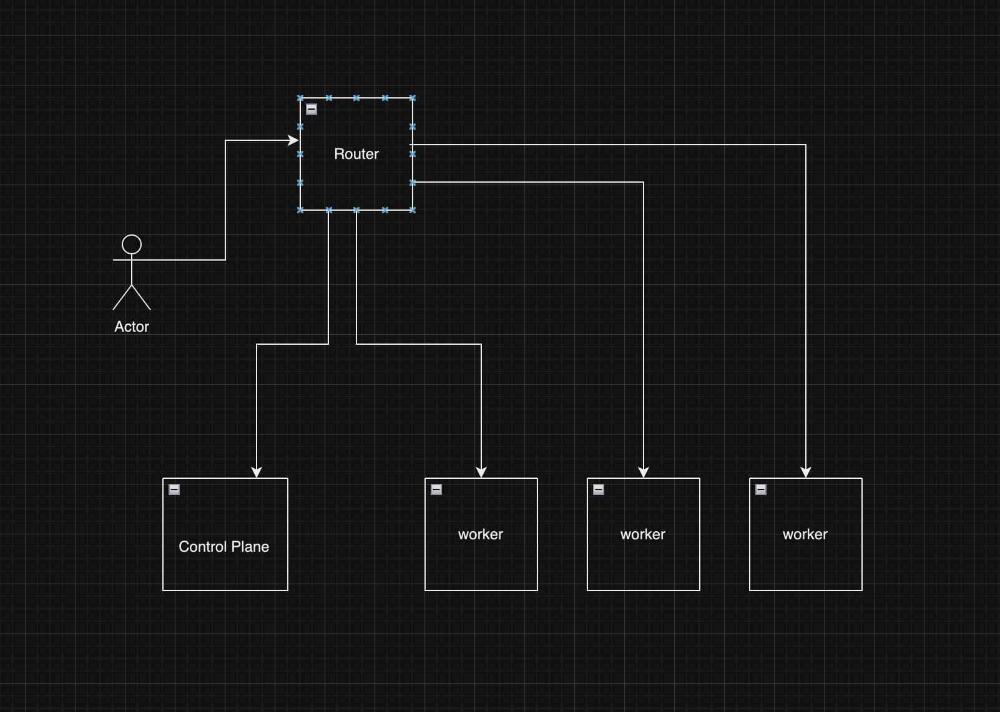
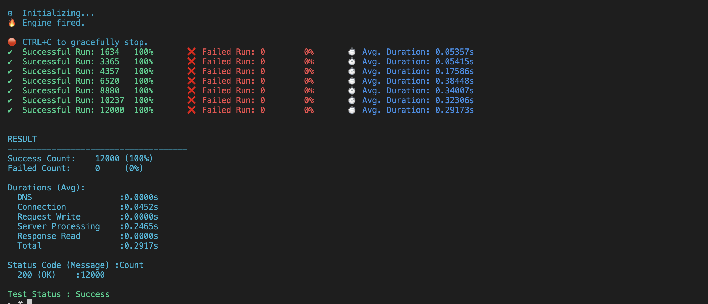

# An explanation of how my cluster's infrastucture is

My cluster consists of 4 nodes with 1 control-plane and 3 workers

Due to bare metal environment, there're some aspects I want to intergrate to my cluster such as:
+ External Storage (pods are ephemeral, I need data somehow could be persisted across recreation)
+ External Load-Balancer IP range (autmatic provisioning an IP address based on defined range for newly created service)

For external IP, I selected MetalLB solution as following:
- A router having BGP routes learned from all nodes
- A speaker daemonset running on all node to advertise the defined IPs range themselves to router
- Router has been configured bgp and ecmp to load balance traffic among nodes

After everything got set up and was green to test, I've created the nginx service to test

truonghoangphuloc@phus-MacBook-Pro Metallb % kubectl get svc

NAME         TYPE           CLUSTER-IP      EXTERNAL-IP    PORT(S)        AGE
kubernetes   ClusterIP      10.96.0.1       <none>         443/TCP        3d2h
nginx        LoadBalancer   10.107.90.218   172.16.1.220   80:32613/TCP   3s

The External IP address assigned for this service is 172.16.1.220 which is in the list of defined IPs range

On the router
B>* 172.16.1.220/32 [20/0] via 172.16.1.201, eth0, weight 1, 00:00:20
  *                        via 172.16.1.202, eth0, weight 1, 00:00:20
  *                        via 172.16.1.203, eth0, weight 1, 00:00:20
  *                        via 172.16.1.204, eth0, weight 1, 00:00:20

The router has learned the IP of nginx service from all nodes and being able to send out traffic in balance manner

For simplicity, I added static route on my host for testing
172.16.1.220/32    172.16.1.210       UGSc           en0

After doing some tests, I find that my cluster's able to handle about 12k connections (using ddostify to evaluate). When I increase the number of connections exceeding 12k, it starts to get errors.

But when I check the connections on nodes, only 1 node (control plane) received the request from my host

After doing some research, I found that I need to use L4 hashing on ECMP instead of L3 (by default)

set system sysctl parameter net.ipv4.fib_multipath_hash_policy value 1

I was curious what is ecmp hashing and found this one:
https://datatracker.ietf.org/doc/html/rfc2992

It explained how ecmp works by. To be honest, I'm not good at math and not sure if my logic's true but it seems the more parameters we add into hash (source port and dest port in case L4), the chance of getting different regions that we have in result is higher

Lets re-test and increase the number of connections

At this time, the nodes all receive traffic from router to it as expected