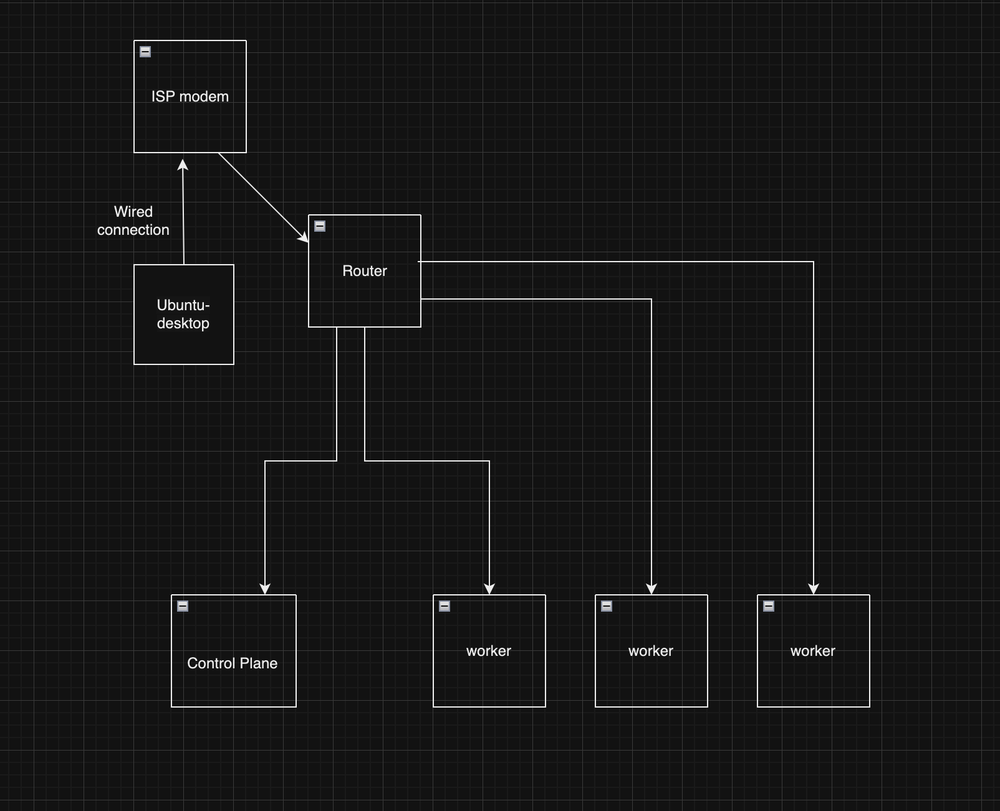

# An explanation of how my cluster's infrastucture is

My cluster consists of 4 nodes with 1 control-plane and 3 workers

Due to bare metal environment, there're some aspects I want to intergrate to my cluster such as:
+ External Storage (pods are ephemeral, I need data somehow could be persisted across recreation)
+ External Load-Balancer IP range (autmatic provisioning an IP address based on defined range for newly created service)

For external IP, I selected MetalLB solution as following:
- A router having BGP routes learned from all nodes
- A speaker daemonset running on all node to advertise the defined IPs range themselves to router
- Router has been configured bgp and ecmp to load balance traffic among nodes

After everything got set up and was green to test, I've created the nginx service to test

The External IP address assigned for this service is 172.16.1.220 which is in the list of defined IPs range

On the router

B>

  * 172.16.1.220/32 [20/0] via 172.16.1.201, eth0, weight 1, 00:00:20
  *                        via 172.16.1.202, eth0, weight 1, 00:00:20
  *                        via 172.16.1.203, eth0, weight 1, 00:00:20
  *                        via 172.16.1.204, eth0, weight 1, 00:00:20

The router has learned the IP of nginx service from all nodes and being able to send out traffic in balance manner

For simplicity, I added static route on my host for testing
172.16.1.220/32    172.16.1.210       UGSc           en0

After doing some tests, I find that my cluster's able to handle about 12k request / 10 seconds (using ddosify to evaluate). When I increase the number of connections exceeding 12k requests, it starts to get errors.

But when I check the connections on nodes, only 1 node (control plane) received the request from my host

After doing some research, I found that I need to use L4 hashing on ECMP instead of L3 (by default)

set system sysctl parameter net.ipv4.fib_multipath_hash_policy value 1

I was curious what is ecmp hashing and found this one:
https://datatracker.ietf.org/doc/html/rfc2992

It explained how ecmp works by. To be honest, I'm not good at math and not sure if my logic's true but it seems the more parameters we add into hash (source port and dest port in case L4), the higher the chance of getting different regions(each region's equivalent to a node) that we have in result is.

Lets re-test and increase the number of connections

At this time, the nodes all receive traffic from router to it as expected

# I've redone the test

Last time, I said that my cluster was able to handle about 12k connections but each test had inconsistent result. I supposed that I was running the ddosify container in my mac, which had wireless connection. The flow of the test at that time was:

My assumption was the wireless connection is half-duplex and it could degrade result of tests. I decided to spin up ubuntu-desktop vm which has a wired connection to ISP modem

After having several needed things set up, I re-ran the test and surprisingly, it's now can handle about up to 100k requests / 10 seconds (10k requests / second) 🤣. Now I'm able to believe my assumption is fairly exact

# Does it actually improve performance?

Now all nodes in my cluster are able to receive traffic balancing-distributed from router. I've already done  observation on what's going to be if I just want only one node receive traffic by rollback the hash to L3 or directly connecting to node port on specific node. The result was that it seemed not really important. It's still be able to handle the same number of requests as being handled by multiple nodes. So that in my opinion, it relates to redundancy more than improving performance because routing doesnt cost too much resources in my context.

I've also increased the number of pods and re-checked again, and, the capacity of handling number of request was increased.

# Several funny things I've learned

+ Firstly, as you've probably noticed, my cluster has a special node (k8s-additional-worker) which is a rocky linux node. I wanted my cluster to have varying distros and it turns out more difficult than I thought. 

+ The rest of my cluster is ubuntu nodes. When they're ready to have applications deployed on them, I decided to add rocky node to. I was experiencing the rocky node in NotReady state. Then, I googled and it turned out the problem is the configuration of resolve. The boostrap phase's going to detect whether the system's using systemd-resolve to configure kubelet. Systemd-resolve is default configured on ubuntu and rocky is otherwise. 

+ Finally, I have to hardcode the configuration of kubelet on my rocky node to use /etc/resolve.conf instead of
/run/systemd-resolve/resolve.conf

+ Secondly, I tried to set the value of net.ipv4.fib_multipath_hash_policy sysctl parameter permanently by adjusting file /etc/sysctl.conf as usual. But not in my case, I'm using VyOs router and even I set that parameter through /etc/sysctl.conf, it'll be gone after rebooting.

+ Eventually, I found the the correct way that I had to use the set command in configure mode of router 

There're the things that I've learned from this journey and they're all funny, useful and amazing to me. It's made me more interested when I found out something I've never been aware.

