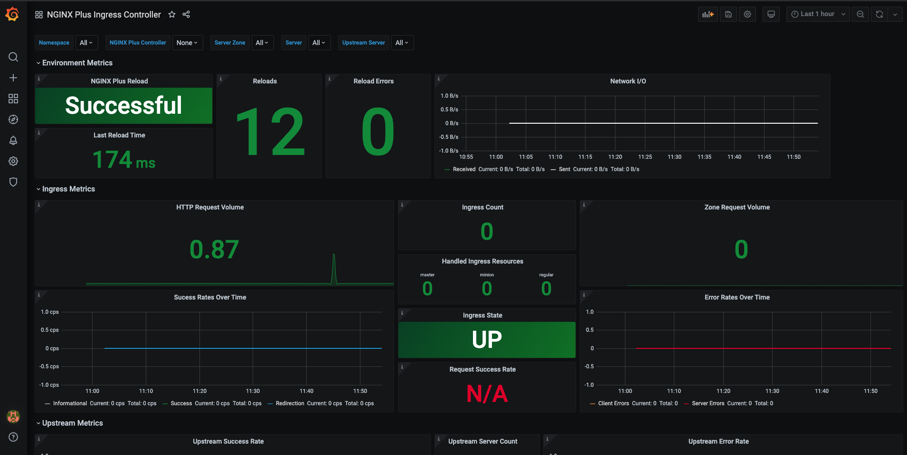

# Grafana Dashboard

We provide the official Grafana dashboard that visualizes the metrics exposed by the NGINX Ingress Controller. The
dashboard allows you to filter metrics per Ingress Controller replica or see the metrics from all replicas.

## Prerequisites

The dashboard has been tested with the following software versions:

- Grafana >= v7.2.0
- Prometheus >= v2.18.1

A Prometheus data source needs to be [added](https://prometheus.io/docs/visualization/grafana/#using) before installing
the dashboard.

## Installing the Dashboard

In the Grafana UI complete the following steps:

1. Use the *New Dashboard* button and click *Import*.
2. Upload `NGINXPlusICDashboard.json` or copy and paste the contents of the file in the textbox and click *Load*.
3. Set the Prometheus data source and click *Import*.
4. The dashboard will appear. Note how you filter metrics per namespace, per replica name and also per NGINX Plus server
   zone, server and upstream server  (top left corner).

## Graphs

The dashboard comes with 4 rows with the following graphs (the corresponding Prometheus metrics are in parentheses):

- Environment Metrics
  - NGINX Plus Reload (`nginx_last_reload_status`). This graph shows the state of the last NGINX Plus reload,
    `Successful`/`Failed`.
  - Last Reload Time (`nginx_last_reload_milliseconds`) graph shows duration of the last reload in milliseconds.
  - Reloads ( `nginx_reloads_total`). This graph shows the total times NGINX Plus has reloaded.
  - Reload Errors (`nginx_reload_errors_total`) graph shows the total number of times NGINX Plus has failed to reload.
  - Network I/O (`nginxplus_server_zone_received` and `nginxplus_server_zone_sent`). This graphs shows the traffic sent
    and received by the Ingress Controller.
- Ingress Metrics
  - HTTP Request Volume (`nginxplus_http_requests_total`). This graphs shows the total number of HTTP requests received
    by the Ingress Controller.
  - Success Rate Over Time (`nginxplus_server_zone_responses`). This graph shows all the `1XX`, `2XX` and `3XX` status
    code responses the Ingress Controller has returned over time.
  - Error Rate Over Time (`nginxplus_server_zone_responses`). This graph shows all the `4XX` and `5XX` status code
    responses the Ingress Controller has returned over time.
  - Ingress Count (`ingress_resources_total`). The total number of Ingress resources the Ingress Controller is handling
    at that time.
  - Handled Ingress Resource (`ingress_resources_total`). This shows the different types of Ingress resources the
    Ingress Controller is handling, `Master`, `Minion` or `Regular`.
  - Ingress State (`nginxplus_up`). This shows the current state of the Ingress Controller, `up`/`down`.
  - Request Success Rate (`nginxplus_server_zone_responses`). This graph shows all the non-`4XX` and `5XX` status code
    responses divided by the total status code responses.
  - Zone Request Volume (`nginxplus_server_zone_requests`). This graph shows the total HTTP request across all server
    zones over the last 5 minutes.
- Upstream Metrics
  - Upstream Success Rate (`nginxplus_upstream_server_responses`). This graph shows all the `1XX`, `2XX` and `3XX`
    status code responses of upstreams over time.
  - Upstream Error Rate (`nginxplus_upstream_server_responses`). This graph shows all the `4XX` and `5XX` status code
    responses of upstreams over time.
  - Upstream Server Count (`nginxplus_upstream_server_state`). This graph shows the count for the total number of
    upstream servers.
  - Upstream Server State (`nginxplus_upstream_server_state`). This graph shows the current state of the upstream
    servers.
- SSL
  - SSL Performance (`nginxplus_ssl_handshakes`, `nginxplus_ssl_handshakes_failed`). The graph shows the total number of
    SSL handshakes and the total number of SSL handshakes that failed.
