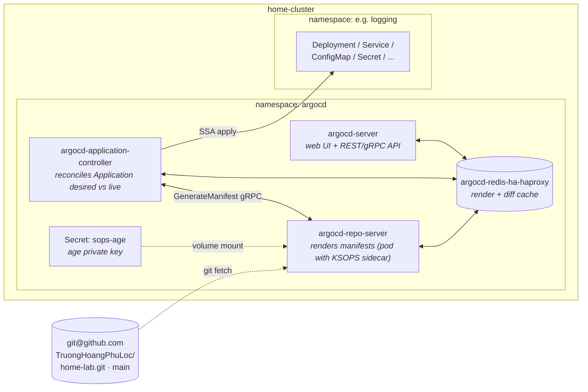
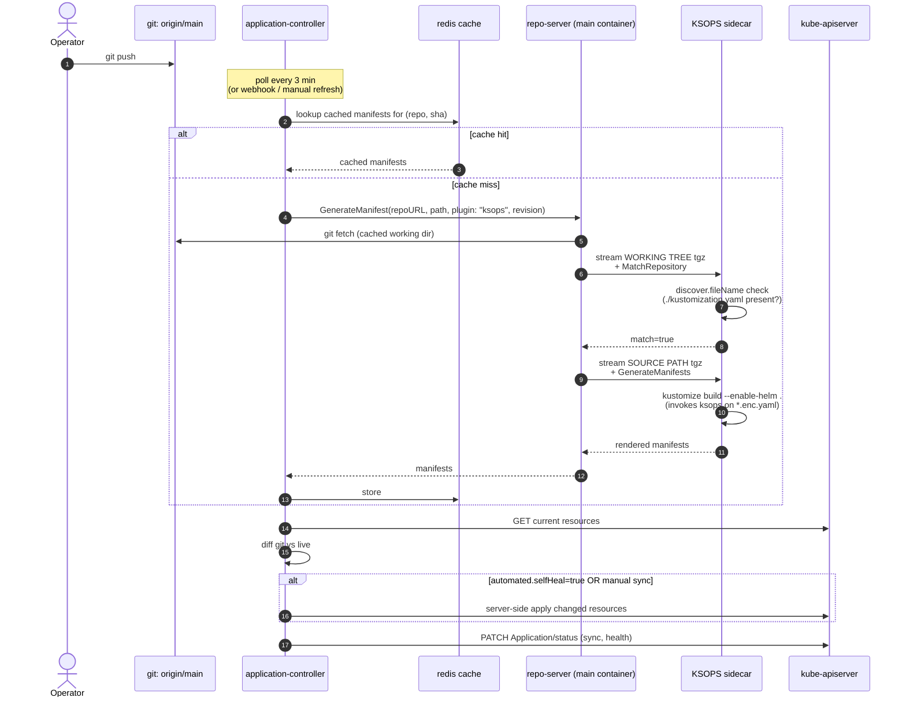
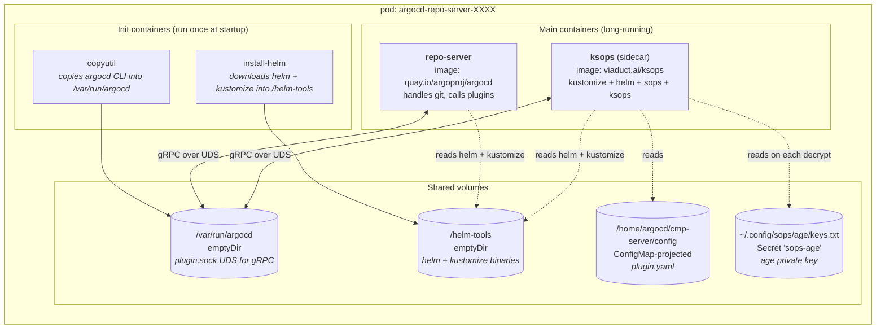
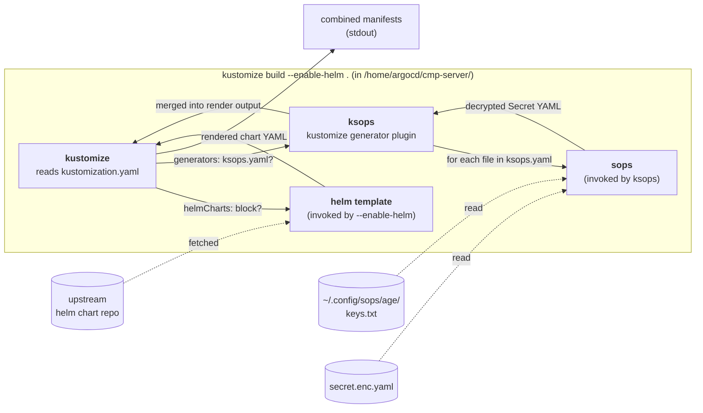

# ArgoCD architecture in this repo

How a `git push` to [`TruongHoangPhuLoc/home-lab`](https://github.com/TruongHoangPhuLoc/home-lab) becomes live state on `home-cluster`. Read after [`BOOTSTRAP.md`](./BOOTSTRAP.md), which covers SOPS/age key setup but not how the runtime actually works.

This file answers: *"When I commit a `secret.enc.yaml`, what exactly runs, where, and in what order?"*

---

## Table of contents

1. [Cluster components](#1-cluster-components)
2. [The Application CRD lifecycle](#2-the-application-crd-lifecycle)
3. [Inside the argocd-repo-server pod](#3-inside-the-argocd-repo-server-pod)
4. [The CMP plugin protocol (Match → Generate)](#4-the-cmp-plugin-protocol-match--generate)
5. [The Kustomize-wraps-Helm + KSOPS render pipeline](#5-the-kustomize-wraps-helm--ksops-render-pipeline)
6. [File layout: which file does what at render time](#6-file-layout-which-file-does-what-at-render-time)
7. [Performance: repo size, `.argocdignore`, gRPC deadlines](#7-performance-repo-size-argocdignore-grpc-deadlines)
8. [Glossary](#8-glossary)

---

## 1. Cluster components

ArgoCD on this cluster is the upstream Helm chart `argo-cd-9.5.4` (app version `v3.3.8`), installed in the `argocd` namespace. The pieces relevant to a sync are:



Roles at a glance:

| Component | What it does | Why we touch it |
|---|---|---|
| `argocd-server` | Web UI / REST API / `argocd` CLI endpoint. | Mostly read-only from our perspective; we drive things via committed `application.yaml` files, not the UI. |
| `argocd-application-controller` | The reconciliation loop. For every `Application`, it asks repo-server for the desired manifests, diffs against live, and applies the difference. | Where `prune`/`selfHeal`/`automated` decisions are made. |
| `argocd-repo-server` | Stateless renderer. Clones the repo, runs `kustomize build` (and helm/ksops via plugins), returns manifests. **No cluster API access**, by design. | This is where KSOPS lives, and where the failure modes documented in [`LESSONS.md`](./LESSONS.md) tend to surface. |
| `argocd-redis-ha-haproxy` | Caches rendered manifests + last-seen diff state. | Why a "Manifest generation error (cached)" message can persist after the underlying problem is fixed — see [`LESSONS.md`](./LESSONS.md#cache-invalidation). |
| Secret `sops-age` | Holds the **age private key** in the `argocd` namespace. Created once, manually, per [`BOOTSTRAP.md`](./BOOTSTRAP.md#one-time-cluster-bootstrap). | Mounted into the KSOPS sidecar so it can decrypt `*.enc.yaml`. |

There is **no controller**, **no CLI**, **no operator** that reads encrypted files outside the cluster. The only place plaintext exists at runtime is inside the KSOPS sidecar, transiently, during `generate`.

---

## 2. The Application CRD lifecycle

An `Application` is just a CRD. Its `spec` says *where the source is* and *where to apply manifests*; its `status` is written back by the controller.

The lifecycle of one sync, end to end:



Key detail: **the controller never sees the encrypted file directly**. It only ever sees the *post-decryption* `Secret` YAML that the repo-server returns. The age private key never leaves the `argocd-repo-server` pod's KSOPS sidecar.

What kicks off step 1's "GenerateManifest" call:
- Periodic refresh (default 180s).
- Webhook from GitHub (we don't currently use this).
- `argocd app refresh <name>` (soft) or `argocd app refresh <name> --hard` (bypass cache).
- Operator clicks "Refresh" / "Sync" in the UI.
- New commit on `targetRevision` is observed.
- The Application's `spec` changed (e.g., we edited `application.yaml`).

---

## 3. Inside the argocd-repo-server pod

This pod is where the KSOPS plumbing lives. It's also where every interesting failure mode happens.



Important runtime facts:

- **`repo-server` and `ksops` are sibling containers in the same pod.** They communicate over a Unix domain socket on a shared `emptyDir` volume mounted at `/var/run/argocd/<plugin-name>.sock`.
- **No cluster API access.** Neither container has a serviceaccount that lets it touch random cluster resources. The blast radius of a bad render is bounded.
- **Plugins are stateless.** Every `MatchRepository` / `GenerateManifests` call ships the working tree (or source path) tarball over the socket. Nothing is persisted between calls except git's own clone cache and the in-memory render cache.
- **`plugin.yaml` is loaded at sidecar startup**, not on every call. If you change the CMP config, you have to roll the repo-server pods.
- **The age private key file sits on tmpfs** (the projected Secret volume). It's never written to disk persistently.

What's actually in our `plugin.yaml` (extracted live from `argocd-repo-server` → `ksops` container at `/home/argocd/cmp-server/config/plugin.yaml`):

```yaml
apiVersion: argoproj.io/v1alpha1
kind: ConfigManagementPlugin
metadata:
  name: ksops
spec:
  allowConcurrency: true
  generate:
    command: ["sh", "-c"]
    args: ["PATH=/helm-tools:$PATH kustomize build --enable-alpha-plugins --enable-exec --enable-helm ."]
  discover:
    fileName: "./kustomization.yaml"
  lockRepo: false
```

Two phases worth noticing:
- `discover` runs on every "is this plugin appropriate for this source path?" check. Cheap.
- `generate` is the actual `kustomize build` invocation. Expensive — pulls helm charts, runs ksops, etc.

---

## 4. The CMP plugin protocol (Match → Generate)

The Application's `spec.source.plugin.name: ksops` tells repo-server to route this Application's renders to the `ksops` sidecar. The sidecar exposes a gRPC service over the UDS with two relevant methods:

| RPC | Called when | Carries | Returns |
|---|---|---|---|
| `MatchRepository` | First-time discovery, after `argocd-repo-server` restart, on cache miss | `tgz` of the **whole working tree** | `match: true/false` based on `discover.fileName` |
| `GenerateManifests` | Every time a render is needed | `tgz` of the **source path subtree only** (`spec.source.path`) | Rendered YAML |

**This distinction matters for performance.** `GenerateManifests` is small (one component directory). `MatchRepository` is potentially huge — it ships everything in the repo (minus `.argocdignore` hits). Hit it with a 100 MB working tree and you'll exceed the gRPC deadline. See [`LESSONS.md` → 2026-04-28](./LESSONS.md#2026-04-28--ksops-cmp-discovery-timeout) for the incident that made us care about this.

Both RPCs run with a default deadline of **60 seconds**.

---

## 5. The Kustomize-wraps-Helm + KSOPS render pipeline

When `kustomize build --enable-helm` runs inside the `ksops` sidecar against a component directory, three subsystems compose:



In our two patterns:

**Pattern A — Kustomize-wraps-Helm + KSOPS** (most of `platform/`)

- `kustomization.yaml` has both `helmCharts:` (chart pulled from upstream, rendered with `valuesFile: values.yaml`) and `generators: [ ./ksops.yaml ]` (encrypted secrets).
- All three blocks (kustomize, helm, ksops) participate.
- Reference: [`platform/observability/agents/promtail/`](../observability/agents/promtail/).

**Pattern B — Raw manifests + KSOPS** (e.g. `apps/homepage/`)

- No `helmCharts:` block. `kustomization.yaml` lists `resources: [ manifests.yaml, configmap.yaml ]` and (if needed) `generators: [ ./ksops.yaml ]`.
- Helm is not invoked — `--enable-helm` is harmless when no `helmCharts` block exists.
- Reference: [`apps/homepage/`](../../apps/homepage/).

The plugin name in `application.yaml` is the same in both cases (`plugin: { name: ksops }`). The plugin doesn't care whether helm participates — `kustomize build` figures that out from the `kustomization.yaml` itself.

---

## 6. File layout: which file does what at render time

For a typical component directory:

```
<component>/
├── application.yaml      # ArgoCD CRD. Lives in argocd ns. Read by application-controller.
├── kustomization.yaml    # Read by kustomize inside the ksops sidecar.
├── values.yaml           # Read by helm (only if helmCharts: block present).
├── manifests.yaml        # (Pattern B) Read by kustomize as a `resources:` entry.
├── configmap.yaml        # (Pattern B) Same.
├── ksops.yaml            # Read by kustomize as a `generators:` entry. Tells ksops which encrypted files to decrypt.
└── secret.enc.yaml       # Read by sops (invoked by ksops). Plaintext only ever lives in memory.
```

End-to-end, the role of each file in the request flow:

| File | Where it's consumed | When |
|---|---|---|
| `application.yaml` | `kubectl apply` once → sits in `argocd` namespace as an `Application` CR. Read by application-controller on every reconcile. | Once per change to the file. |
| `kustomization.yaml` | `discover` step (heuristic) + `generate` step (real consumer). | Every render. |
| `values.yaml` | `helm template` invoked from `kustomize build --enable-helm`. | Every render where `helmCharts:` is present. |
| `manifests.yaml` / `configmap.yaml` | Read by kustomize as plain `resources:`. | Every render in Pattern B. |
| `ksops.yaml` | Read by kustomize as a generator config. Points to the encrypted file. | Every render with secrets. |
| `secret.enc.yaml` | Read by `sops` inside ksops. Decrypted in-memory only. | Every render with secrets (no caching of plaintext). |

The encrypted file's `data:` / `stringData:` fields stay opaque on disk; everything else (metadata, labels, type) stays readable. That's [`/.sops.yaml`](../../.sops.yaml)'s `encrypted_regex: ^(data|stringData)$` doing its job.

---

## 7. Performance: repo size, `.argocdignore`, gRPC deadlines

Two performance facts we have hit in practice:

- **`MatchRepository` ships the whole working tree.** Not just the source path. Not just files matching some glob. The whole tree. The `discover` config is just a filter applied *after* the tarball arrives at the sidecar.
- **The default gRPC deadline is 60 seconds.** It is not configurable per-application.

Therefore, **anything in the working tree that isn't an ArgoCD source path is dead weight on every cold MatchRepository call.** This includes:
- Manual k8s install scripts under `infrastructure/`.
- Source code, static assets, build artifacts under `apps/<app>/` (when the app's Application points at `apps/<app>/k8s/` and not the whole directory).
- Ansible / Jenkins / docker-compose configs under `automation/`.

The mitigation is `.argocdignore` at the repo root. Same syntax as `.gitignore`. ArgoCD excludes matched paths from the tarball it sends to CMP plugins (and from its own glob walks).

Live config: [`/.argocdignore`](../../.argocdignore). When adding a new directory to the repo, the rule of thumb is:

- **Is it the `path:` of any `Application`?** → must NOT be excluded.
- **Does it contain a future `Application` source?** → leave it visible.
- **Is it pure operator/infrastructure content that ArgoCD should never look at?** → add to `.argocdignore`.

The exact incident that taught us this is documented in [`LESSONS.md` → 2026-04-28](./LESSONS.md#2026-04-28--ksops-cmp-discovery-timeout).

### Cache invalidation

Once a generation fails, the failure itself is cached in redis with the message body prefixed `Manifest generation error (cached): ...`. The cache key includes the git sha, so:

- A new commit naturally bypasses the cache.
- A commit that doesn't touch the affected component **does not** bypass the cache.
- `argocd app refresh <name> --hard` bypasses the cache.
- Bouncing the redis pod also clears it (heavy-handed; affects every Application).

If you fix a problem and the error still shows the same message with `(cached)` — refresh hard or wait for the next commit.

---

## 8. Glossary

| Term | Meaning |
|---|---|
| **CMP** | Config Management Plugin. ArgoCD's sidecar-based extension mechanism for custom manifest generation. KSOPS is one. |
| **CRD** | Custom Resource Definition. `Application` is one of ArgoCD's. |
| **gRPC** | The protocol the controller uses to talk to repo-server, and repo-server uses to talk to CMP plugins. |
| **GenerateManifests** | gRPC method on the CMP service. Returns rendered YAML for a source path. |
| **KSOPS** | A kustomize generator plugin that delegates to `sops` for `*.enc.yaml` files. <https://github.com/viaduct-ai/kustomize-sops> |
| **MatchRepository** | gRPC method on the CMP service. Answers "is this plugin applicable to this repo?". Triggers the heavy tgz transfer. |
| **SOPS** | Secrets-OPerationS. CLI tool for encrypting structured config. <https://github.com/getsops/sops> |
| **SSA** | Server-Side Apply. The Kubernetes apply mode ArgoCD uses (we set `ServerSideApply=true`). Allows clean co-management when adopting an existing helm release. |
| **UDS** | Unix Domain Socket. How `repo-server` and `ksops` talk inside the pod. |
| **Working tree** | Everything tracked by git (modulo `.argocdignore`). Distinct from the source path. |

---

## See also

- [`BOOTSTRAP.md`](./BOOTSTRAP.md) — SOPS/age key setup and the one-time cluster bootstrap that creates the `sops-age` Secret.
- [`LESSONS.md`](./LESSONS.md) — running log of incidents and what we learned.
- [`platform/CLAUDE.md`](../CLAUDE.md) — the canonical component-directory templates and adoption workflow.
- [`apps/CLAUDE.md`](../../apps/CLAUDE.md) — same patterns applied to end-user workloads (Variant A: Kustomize-wraps-Helm; Variant B: raw manifests).
