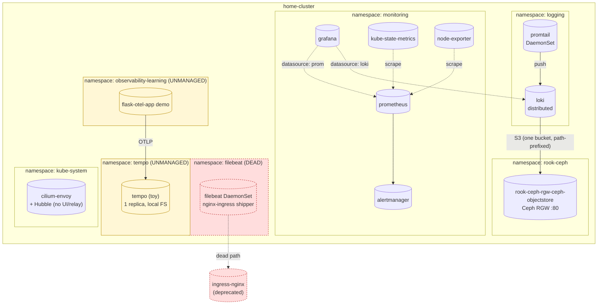
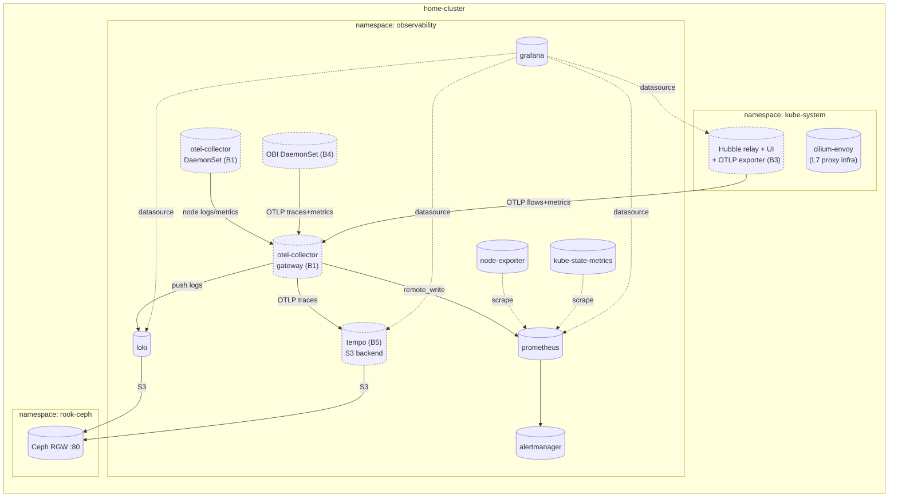

# observability/PLAN.md

Working plan for the **observability redesign**. Sequenced so the
disruptive structural change (namespace consolidation) lands first, then
the OTel Collector cutover, then layered tracing (Hubble → OBI → SDK
instrumentation), then a real trace backend (Tempo).

This document is a planning artifact — no code changes have been made yet.

Cross-references:
- Architecture decision (Option B, full OTel): memory `project_observability_redesign.md`.
- ArgoCD adoption pattern: [`../CLAUDE.md`](../CLAUDE.md).
- Loki bucket / OBC pattern (precedent for Tempo when it lands):
  [`logging/loki/ARCHITECTURE.md`](./logging/loki/ARCHITECTURE.md).

---

## 1. Goals

1. **Consolidate every observability workload into a single
   `observability` namespace.** Today signals are split across `logging`,
   `monitoring`, and a leftover toy `tempo` namespace. Centralising now
   means future ServiceMonitors, NetworkPolicies, RBAC, and Grafana
   datasource URLs only get written once.
2. **Decommission orphan namespaces:** the toy `tempo` deploy, the
   `observability-learning` demo, and the dead `filebeat` DaemonSet (the
   nginx-ingress access-log shipper that died with ingress-nginx).
3. **Replace promtail with the OTel Collector** for log shipping, on a
   short parallel-run window before retiring promtail.
4. **Layer in zero-code tracing** via Cilium Hubble (already deployed) +
   OBI (eBPF, new) before adding any application code instrumentation.
5. **Land Tempo as a real ArgoCD-managed backend** only after there is
   actual trace volume to size retention against.
6. **Avoid stateful-data damage** on the kube-prom-stack PVCs except where
   the user has accepted the tradeoff (Prometheus TSDB — see
   memory; data loss accepted).

Out of scope for this plan:
- Custom iplookup OTel processor (Phase B6).
- OTel `prometheus` receiver replacing kube-prom-stack scrape jobs (B7).
- Instrumenting `chat-app` with OTel SDK (B8).
- Envoy distributed tracing via `CiliumEnvoyConfig` — see §10 "Open
  direction"; explicitly **not** scheduled.

---

## 2. Current state

### 2.1 Inventory (verified against `home-cluster` 2026-05-01)

| Namespace | What's there | Managed by | Storage |
|---|---|---|---|
| `logging` | loki (distributed) + promtail DaemonSet | ArgoCD | Ceph RGW S3 (single OBC `loki-storage`) |
| `monitoring` | kube-prometheus-stack: prometheus-0, alertmanager-0, grafana-0, KSM, operator, node-exporter DaemonSet, etcd-cert-syncer CronJob | ArgoCD | `ceph-block` PVCs — prometheus 50Gi, alertmanager 5Gi, grafana 5Gi |
| `tempo` | Single `tempo` Deployment (1 replica, `grafana/tempo:latest`, `local` backend, no persistence, manual `kubectl apply`) | **Unmanaged** | emptyDir |
| `observability-learning` | `flask-otel-app` Deployment + LoadBalancer Service | **Unmanaged** | none |
| `filebeat` | `filebeat` DaemonSet — was shipping nginx-ingress access logs to Elasticsearch | **Unmanaged** | hostPath |
| `kube-system` | `cilium` + `cilium-envoy` DaemonSets, Hubble enabled (no UI/relay yet) | Helm | n/a |

### 2.2 Diagram — current state



---

## 3. Target state

### 3.1 Namespace model (post-consolidation)

Single `observability` namespace contains every signal-producing or
signal-consuming component:

| Component | Status |
|---|---|
| loki (distributed) | moved from `logging` ✓ |
| **promtail** | **retired** — replaced by otel-collector node-collector |
| kube-prometheus-stack | moved from `monitoring` ✓ |
| otel-collector node-collector + cluster-collector | landed (B1) ✓ |
| (B3) Hubble OTLP/metrics exporter | future, namespace TBD — likely `kube-system` next to cilium |
| (B4) OBI DaemonSet | future |
| (B5) tempo | future, replaces the toy `tempo` namespace deploy |

Namespaces deleted: `logging`, `monitoring`, `tempo`, `observability-learning`,
`filebeat` ✓.

### 3.2 Diagram — target state (post-B5)



### 3.3 Repo layout (target)

```
platform/observability/
├── PLAN.md                              # this file
├── agents/
│   ├── promtail/                        # destination ns flips to observability (B0); retired in B1
│   ├── otel-collector/                  # B1 — DaemonSet + gateway in one Application
│   └── obi/                             # B4 — eBPF zero-code tracer
├── logging/
│   └── loki/                            # destination ns flips to observability (B0)
├── monitoring/
│   └── kube-prometheus-stack/           # destination ns flips to observability (B0)
└── tracing/
    ├── hubble-exporter/                 # B3 — UI/relay + OTLP exporter; lives next to cilium
    └── tempo/                           # B5 — backend lands last; ARCHITECTURE.md alongside
```

---

## 4. Phased migration plan

**B0 = namespace consolidation. Everything else is gated behind it.** B1+
references the future-state directories above; details for those phases are
sketched here so the dependencies are visible, but full design lands when
each phase opens.

### B0 — namespace consolidation (this session's primary work)

The scope of B0 is **only** moving existing ArgoCD-managed Applications
into the `observability` namespace and cleaning up orphan namespaces. No
new Applications, no new components, no Tempo.

**Why this is non-trivial:** ArgoCD with `selfHeal=true` interprets a
change to `spec.destination.namespace` as "delete every resource in the
old namespace and create it in the new one." Stateless Applications
(promtail) handle this fine. StatefulSets recreate, dropping in-flight
state. For kube-prometheus-stack the 50Gi Prometheus PVC is **not
preserved** under K1 (Option K1 — accepted, see §5).

#### B0.1 — scaffold the `observability` namespace

A tiny bootstrap so subsequent Applications don't each need
`CreateNamespace=true`:
- Add `Namespace/observability` as a kustomize resource alongside the
  first migrating Application (promtail or loki — pick whichever moves
  first). Once the namespace exists, subsequent Applications just point
  `destination.namespace` at it with `CreateNamespace=false`.
- Add a NetworkPolicy / CiliumNetworkPolicy "deny all egress except
  intra-namespace + DNS + Ceph RGW + cluster API". Keep this
  conservative; future Applications declare exceptions.
  (Stretch — could split into a separate commit after B0 lands.)

#### B0.2 — promtail (trivial)

- Flip `destination.namespace: logging → observability`.
- Bump `helmCharts[0].namespace` in `kustomization.yaml`.
- Sync. Pods recreate, no state to preserve.
- Verify pushes still reach Loki (still in `logging` at this step;
  cross-namespace push works fine — no auth, ClusterIP Service).

> Note: promtail will be retired entirely in B1 (replaced by
> otel-collector). If B1 is starting <1 week after this work, **skip the
> promtail namespace move** and just delete promtail when otel-collector
> reaches parity.

#### B0.3 — Loki

- Storage is S3 — bucket persists regardless of namespace move.
- Move OBC + Application + kustomization namespace fields together in a
  single commit.
- StatefulSets recreate; ingester WAL is lost on cutover (≤5 min of
  unflushed log lines). Acceptable.
- Cilium NetworkPolicies (if any reference `namespace: logging`) need
  updating in the same commit.
- Promtail's Loki push URL changes
  (`loki-gateway.logging.svc → loki-gateway.observability.svc`). Bundle
  this with the Loki move, or move promtail first into observability so
  its push URL only changes once.

#### B0.4 — kube-prometheus-stack (highest risk)

Decision **K1 (accept TSDB data loss)** is locked in (see memory). 15-day
Prometheus history is rebuildable; operational simplicity wins.

Steps:
1. Disable `automated.selfHeal` on the Application **immediately
   before** the namespace-change commit. Push that disable as its own
   commit so the timing is auditable.
2. Push the namespace change.
3. Manually trigger sync; watch the Prometheus / Alertmanager / Grafana
   StatefulSets recreate in the new namespace with fresh PVCs.
4. Re-enable `selfHeal: true` only after 2–3 clean cycles in the new
   namespace.
5. Update Grafana datasource URLs (`*.monitoring.svc → *.observability.svc`)
   in the same commit as the namespace change. Add to diff review.
6. Re-issue TLS Secrets — cert-manager will reissue
   `grafana-certificate`, `prometheus-certificate`,
   `alertmanager-certificate` automatically once the Ingresses move to
   the new namespace. Brief gap acceptable.
7. The `etcd-cert-syncer` CronJob/Job is already bundled in the
   kube-prom-stack Application — it moves with the rest. Re-test sync
   waves after the namespace change.

#### B0.5 — orphan namespace cleanup

Strict order, **after** the four moves above are green:

1. `kubectl delete ns tempo` — toy install, no PVCs.
2. `kubectl delete ns observability-learning` — confirm the LoadBalancer
   IP `172.16.1.169` isn't referenced from anywhere (DNS, BGP). Then
   delete.
3. `kubectl delete ns filebeat` — confirm via `kubectl logs -n filebeat
   ds/filebeat --tail=50` that no consumer still receives its output.
   Then delete.
4. `kubectl delete ns logging` — only after `kubectl get all -n logging`
   is empty.
5. `kubectl delete ns monitoring` — same gate.

### B1 — OTel Collector (logs cutover)

New Application at `platform/observability/agents/otel-collector/`.
Single helm release covering both DaemonSet and gateway Deployment, two
roles selected via the chart's `mode:` field or two sibling Applications
— decide at design time.

Pipeline initially:
- `filelog` receiver (DaemonSet) → batch → `loki` exporter.
- No trace pipeline. No metrics pipeline yet.

Run alongside promtail for 2–3 days; verify log line counts in Loki match
within 1% before retiring promtail.

### B2 — geolocation processor (replaces dead Kibana geo-map)

Add `geoip` processor to the gateway pipeline. Enable on Traefik access
logs only. MaxMind GeoLite2 DB shipped via initContainer download. Build
Grafana geomap dashboard. Note inaccuracy — sets up B6.

### B3 — Hubble exporter + UI

Cilium 1.18 already has Hubble enabled. Stand up:
- `hubble-relay` (cluster-wide flow aggregation)
- `hubble-ui` (service map UI)
- Hubble's OTLP exporter (or `hubble-otel` adapter if the built-in option
  proves limiting) → otel-collector gateway

Lands before OBI because it's cheap (UI/relay are 2 small Deployments)
and high information value (service map, day-1 visibility into who-talks-
to-whom). It also gives a baseline view of cluster traffic that OBI will
later overlay span trees on top of.

Pipeline result: collector receives Hubble flows as OTel logs (or as
metrics, depending on exporter mode). No Tempo yet — flows are not spans;
they don't need a trace backend. Surface them in Grafana as a flow log /
service-map dashboard.

### B4 — OBI DaemonSet (zero-code distributed traces)

Add OBI as a DaemonSet at `platform/observability/agents/obi/`,
exporting OTLP traces + RED metrics to the otel-collector gateway. This
is where **real distributed traces** appear (parent-linked span trees),
without code changes — covers ArgoCD, Loki, Traefik, etc.

Trace-pipeline target: **`debug` exporter on the gateway**. Spans land
in collector logs. This proves the OTLP path works end-to-end before
Tempo is provisioned.

OBI-specific concerns to design through:
- Privileged DaemonSet (root or `CAP_SYS_ADMIN`/`CAP_PERFMON`/`CAP_BPF`)
  — flag against the planned Kyverno policies (security roadmap Layer
  3). Need an explicit allow rule.
- Pod selector labels — only attach to specific workloads or
  cluster-wide?
- Resource limits — eBPF programs are cheap, but the userspace
  exporter can churn memory under high request rate.

### B5 — Tempo (real trace backend)

Add Tempo as an ArgoCD Application at `platform/observability/tracing/tempo/`.
Pin chart version (current candidate: `grafana/tempo` 1.24.4 / app 2.9.0,
single-binary mode). S3 backend reuses the Ceph RGW pattern from Loki
(separate OBC, separate bucket). Replace OBI's `debug` exporter with an
`otlp` exporter pointing at Tempo. Add Tempo as a Grafana datasource and
build a service-graph dashboard.

Validation: telemetrygen + a real OBI-captured trace from a synthetic
ArgoCD sync. ARCHITECTURE.md alongside (mirrors Loki's pattern).

### B6 — custom iplookup processor (highest skill payoff)

Custom OTel processor in Go calling `apps/iplookup/`. Built via `ocb`.
LRU cache + MaxMind fallback. Replaces B2's geoip processor.

### B7 — metrics shift to OTel `prometheus` receiver

Progressively replace kube-prom-stack scrape jobs with OTel
`prometheus` receivers feeding `prometheusremotewrite` exporter. Verify
parity by overlaying Grafana panels before retiring scrape jobs.

### B8 — instrument `chat-app` with OTel SDK

Add OTel SDK to chat-app. In-process spans for DB calls, business logic.
OBI spans become the outer envelope; SDK spans nest inside. End-to-end
service-graph + span-rate dashboard.

---

## 5. Decisions locked in

These are no longer open — recorded here so a future reader doesn't
re-debate them.

| Decision | Choice | Rationale |
|---|---|---|
| Tracing source strategy | Hubble + OBI + SDK in layers (§10) | Cilium gives topology free; OBI gives spans without code; SDK gives depth on chat-app |
| Tempo timing | Phase B5 — *after* OBI lands with `debug` exporter | No backend needed until there's real volume; sizing retention with real data |
| kube-prom-stack PVC migration | Option K1 — accept Prometheus TSDB data loss | 15-day history rebuildable; K2 (snapshot+rebind) too fragile, K3 (side-by-side) too noisy |
| Promtail retirement | Parallel run during B1 (2–3 days) before deletion | Reference: original Phase B1 design in memory |
| Tempo chart variant | Single-binary `grafana/tempo` (not `tempo-distributed`) | Homelab scale; simpler; can switch later if load requires |
| Envoy distributed tracing via `CiliumEnvoyConfig` | **Out of scope, parked as open direction (§10)** | Requires app-level `traceparent` propagation; OBI gives same outcome zero-code; revisit if mTLS/compliance demands it |

---

## 6. Open questions (still to decide at execution time)

1. **Skip the promtail namespace move?** If B1 starts within 1 week of
   B0, moving promtail just to delete it 7 days later is wasted churn.
   Decide based on calendar at execution time.
2. **NetworkPolicy posture for `observability` namespace.** Default
   "deny-all-egress except DNS + intra-ns + Ceph RGW" or permissive
   first, lock down later? Recommendation: permissive in B0, lock down
   as a B0.6 follow-up commit once everything is green.
3. **Hubble exporter location.** `kube-system` (next to cilium) or
   `observability`? `kube-system` is closer to its data source but
   crosses a namespace boundary for the OTLP push. Decide in B3.
4. **OBI deploy shape: DaemonSet vs OBI-as-collector-receiver.** OBI can
   be compiled into a custom collector via `ocb`. Cleaner topology
   (fewer pods) but couples lifecycle. Decide in B4.
5. **OBI pod selector scope.** Cluster-wide auto-attach, or opt-in via
   pod annotation? Cluster-wide gets coverage; opt-in gives control
   over what's traced. Probably opt-in for B4 launch, expand later.

---

## 7. Risks & mitigations

| Risk | Likelihood | Mitigation |
|---|---|---|
| `selfHeal=true` deletes 50Gi Prometheus PVC during namespace flip | Confirmed under K1 — accepted | Disable `selfHeal` immediately before the namespace-change commit; re-enable after move verified. K1 = data loss accepted; just sequence carefully so it isn't surprising. |
| Grafana datasource URLs hardcoded to old `*.monitoring.svc` / `*.logging.svc` | High | Update in the same commit as the namespace flip. Add to diff review checklist. |
| Cilium NetworkPolicies referencing old namespaces block traffic post-move | Medium | `grep -r "namespace: logging\|namespace: monitoring"` across the repo before the move. Update or remove. |
| filebeat is silently feeding something we forgot about | Low–Medium | Inspect filebeat ConfigMap output destinations before deletion. |
| Toy `tempo` Service / Pod still receiving traces from `flask-otel-app` after `tempo` ns delete | Low | `flask-otel-app` is the only known producer; deleted in the same B0.5 step. Sanity-check via `kubectl logs` for OTLP errors before/after. |
| OBI's privileged capabilities clash with Kyverno baseline policy | High (when Layer 3 lands) | OBI explicit allow rule in the Kyverno policy when that lands. Note in security roadmap memory as a known exception. |

---

## 8. Validation gates

**B0 gates (per Application moved):**
- `kubectl get application -n argocd <name>` shows `Synced` + `Healthy`
  for 10+ minutes after the namespace change.
- Pod ages in the new namespace are <migration-window age.
- For loki: `logcli query` against the gateway returns recent log lines.
- For prom: `promtool query instant` returns `up == 1` for a known target.
- For grafana: dashboards render, datasources health-check green.
- Old namespace `kubectl get all -n <old>` is empty before deletion.

**B1+ gates** are designed when each phase opens.

---

## 9. Rollback strategy

- **Promtail / Loki namespace moves:** revert the commit, ArgoCD
  reconciles back to `logging`. Stateless / S3-backed — no data lost
  beyond the cutover gap.
- **kube-prom-stack namespace move:** asymmetric. Once data loss
  happens, rollback can't undo it. The compensating control is the
  `selfHeal` disable / re-enable sequencing — gives a window where the
  operator can intervene before automation deletes the old PVCs.
- **Namespace deletes:** strictly **last**. Once `kubectl delete ns
  logging` runs there is no rollback short of restoring from cluster
  backups.

---

## 10. Tracing source strategy

The redesign uses **three complementary tracing sources**, layered. Each
covers ground the others can't.

### 10.1 What Cilium 1.18 already gives us

Confirmed against `home-cluster`:
- `enable-hubble: true` — flow visibility on
- `enable-l7-proxy: true` — HTTP/gRPC/DNS/Kafka parsing available
- `cilium-envoy` DaemonSet running — sidecar-free L7 proxy infra
- `enable-bgp-control-plane: true` — orthogonal but worth noting
- **Not yet running:** `hubble-relay`, `hubble-ui`, any OTel exporter

So the building blocks are there; only the operator-facing layer is
missing.

### 10.2 The hard limit on Cilium-only tracing

Hubble produces **flow logs**, not distributed traces. Each flow is a
point-in-time event with `src`, `dst`, `verdict`, optional L7 metadata
(`http.method`, `http.status`, latency). They are not linked into span
trees. Cilium has no way to make `argocd-server` propagate `traceparent`
to `argocd-repo-server`; that's an application concern.

So Cilium gives a high-fidelity **service map and flow log**, but for the
"find the slow request through 4 services" use case you need real
distributed traces — which means OBI or SDK instrumentation.

### 10.3 Comparison

| | Cilium Hubble | Cilium Envoy + tracing config | OBI (eBPF) | OTel SDK |
|---|---|---|---|---|
| Already deployed | ✅ (just needs UI/relay) | ✅ infra; needs CEC + trace config | ❌ new DaemonSet | ❌ code changes |
| Service topology | ✅ best-in-class | ✅ via traces | ⚠️ derived from spans | ⚠️ derived from spans |
| Flow-level visibility (L3/L4 + L7 envelopes) | ✅ | ⚠️ only proxied paths | ❌ | ❌ |
| Distributed spans (parent/child) | ❌ | ✅ if apps propagate `traceparent` | ✅ synthesised by eBPF uprobes | ✅ first-class |
| RED metrics | ✅ | ✅ | ✅ | ✅ |
| TLS-encrypted traffic | ✅ envelope only | ❌ unless TLS terminated at Envoy | ✅ envelope; some Go decryption via uprobes | ✅ in-process |
| Application-internal spans (DB, business logic) | ❌ | ❌ | ❌ | ✅ |
| Effort | Low (enable UI) | Medium (CEC + headers) | Medium (DaemonSet + securityContext) | High (code) |

### 10.4 The chosen stack

| Phase | Source | What it adds |
|---|---|---|
| **B3** | Hubble UI + OTLP exporter | Service map, flow logs, L4/L7 metrics |
| **B4** | OBI DaemonSet | Distributed spans synthesised at eBPF layer; covers every Go/Rust/C++ binary cluster-wide without code changes |
| **B8** | OTel SDK in `chat-app` | In-process spans (DB queries, business-logic spans) nesting inside the OBI envelope |

Together: Hubble answers "who talks to whom"; OBI answers "where did this
cross-service request spend its time"; SDK answers "what happened inside
this specific call." Each is the cheapest thing that could produce the
information at its layer.

### 10.5 Open direction — Envoy distributed tracing via `CiliumEnvoyConfig`

**Parked, not scheduled.** Direction noted so the option isn't lost:

- Cilium can configure the per-node `cilium-envoy` to emit traces by
  applying a `CiliumEnvoyConfig` CR with an Envoy `tracing.http` config
  pointing at an OTLP/Zipkin/Jaeger collector.
- **Catch:** Envoy only links spans into a tree when applications
  forward W3C `traceparent` headers through their outbound HTTP calls.
  Without that, every Envoy span is an orphan and you've spent
  configuration effort for the same "flow log" outcome Hubble already
  gives you.
- For homelab purposes, OBI achieves the same "real spans without code
  changes" outcome by synthesising trace context in eBPF — without
  needing app cooperation.
- Worth revisiting if any of these change:
  - mTLS / zero-trust posture forces the trace boundary to be Envoy
    (e.g., for compliance attribution)
  - An app gets instrumented with `traceparent` propagation anyway and
    we want Envoy as the trace source instead of OBI for that path
  - OBI is rejected for some reason (cluster doesn't support eBPF
    features it needs, or Kyverno policy can't accommodate its
    capabilities)
- **Decision rule:** revisit only if a triggering event from the list
  above occurs. Don't backfill it just because it's possible.
