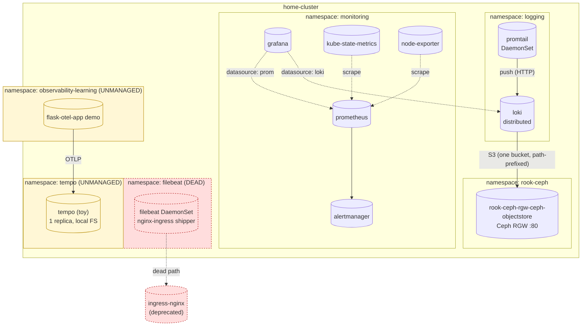
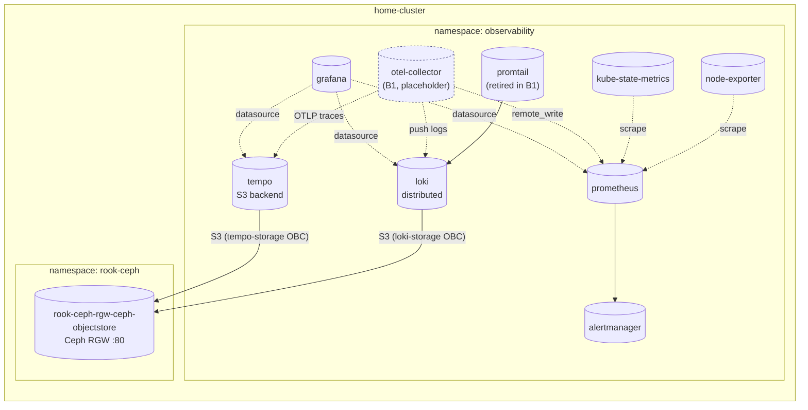

# observability/PLAN.md

Working plan for **Phase B0 of the observability redesign** (deploy Tempo as an
ArgoCD Application) bundled with a **namespace-consolidation migration**
(collapse `logging` + `monitoring` + `tempo` into a single `observability`
namespace). This document is the design output of the planning session — no
code changes have been made yet.

Cross-references:
- Architecture decision record (Option B, full OTel): memory `project_observability_redesign.md`.
- ArgoCD adoption pattern: [`../CLAUDE.md`](../CLAUDE.md).
- Phase plan B0→B5: same memory file. **This document covers B0 only**, plus the namespace consolidation that has to land alongside it because B1+ Applications would otherwise be born into the old split-namespace layout.

---

## 1. Goals

1. **Stand up Tempo as a real, ArgoCD-managed component** at
   `platform/observability/tracing/tempo/`, using the canonical
   Kustomize-wraps-Helm + KSOPS pattern, with its trace storage on the same
   Ceph RGW that backs Loki.
2. **Validate Tempo end-to-end** before anything else gets pointed at it
   (telemetrygen → OTLP gRPC `:4317` → Tempo → S3 → query API).
3. **Consolidate every observability workload into a single `observability`
   namespace.** Today signals are split across `logging`, `monitoring`, and a
   leftover toy `tempo` namespace. Centralising now (before B1's OTel Collector
   and B5's instrumented apps push more endpoints into the system) means
   ServiceMonitor/PodMonitor selectors, NetworkPolicies, RBAC, and Grafana
   datasource URLs only need to be written once, in one place.
4. **Decommission orphaned namespaces**: the old toy `tempo` deploy, the
   `observability-learning` demo, and the dead `filebeat` DaemonSet (the
   nginx-ingress access-log shipper that died with ingress-nginx).
5. **Avoid data loss on stateful components** — Prometheus (50Gi PVC),
   alertmanager (5Gi PVC), Grafana (5Gi PVC) — without that constraint
   driving the whole design.

Out of scope for this plan (deferred to later phases):
- OTel Collector deployment (Phase B1).
- Geolocation pipeline / `geoip` processor (Phase B2).
- Custom iplookup processor (Phase B3).
- OTel `prometheus` receiver replacing kube-prom-stack scrape jobs (B4).
- Instrumenting `chat-app` with OTel SDK (B5).

---

## 2. Current state

### 2.1 Inventory (verified against `home-cluster` 2026-05-01)

| Namespace | What's there | Managed by | Storage |
|---|---|---|---|
| `logging` | loki (distributed: distributor×3, ingester×3, querier×3, qf×2, qs×2, ig×2, compactor×1, gateway, canary, caches) + promtail DaemonSet | ArgoCD (`loki`, `promtail`) | Ceph RGW S3 (single OBC `loki-storage`) — no PVCs |
| `monitoring` | kube-prometheus-stack: prometheus-0, alertmanager-0, grafana-0, kube-state-metrics, operator, node-exporter DaemonSet, etcd-cert-syncer CronJob | ArgoCD (`kube-prometheus-stack`) | `ceph-block` PVCs — prometheus 50Gi, alertmanager 5Gi, grafana 5Gi |
| `tempo` | Single `tempo` Deployment (1 replica, `grafana/tempo:latest`, `local` backend at `/tmp/tempo`, no persistence, manual `kubectl apply -f`) | **Unmanaged** (kubectl-applied 2025-11-17) | emptyDir |
| `observability-learning` | `flask-otel-app` Deployment + LoadBalancer Service | **Unmanaged** | none |
| `filebeat` | `filebeat` DaemonSet (6 nodes, 533d old) — was shipping nginx-ingress access logs to Elasticsearch | **Unmanaged** | hostPath |
| `ingress-nginx` | residual Helm release | **Helm**, deprecated | n/a |

### 2.2 Diagram — current state



Pain points this state creates:
- **Three namespaces** for the three signal types, plus two zombie namespaces.
  Every new tooling step (NetworkPolicy, ServiceMonitor selector, RBAC,
  Grafana provisioning) has to be written N times.
- **Toy Tempo on `:latest` with local storage** silently loses traces every
  pod restart and is invisible to GitOps.
- **Dead filebeat** is still consuming node CPU + memory + producing S3 churn
  against an Elasticsearch that no longer ingests.

---

## 3. Target state

### 3.1 Namespace model

Single `observability` namespace contains every signal-producing or
signal-consuming component:

| Component | Notes |
|---|---|
| loki (distributed) | move from `logging` |
| promtail | move from `logging` (will be retired entirely in B1) |
| kube-prometheus-stack (prometheus, alertmanager, grafana, KSM, operator, node-exporter) | move from `monitoring` |
| **tempo** (NEW) | replaces the toy `tempo` namespace deploy |
| (B1) otel-collector DaemonSet + gateway Deployment | future, but designed for `observability` from day one |

Namespaces to delete after the migration: `logging`, `monitoring`, `tempo`,
`observability-learning`, `filebeat`.

### 3.2 Diagram — target state



### 3.3 Repo layout (target)

```
platform/observability/
├── PLAN.md                              # this file
├── agents/
│   └── promtail/                        # destination namespace flips to observability
├── logging/
│   └── loki/                            # destination namespace flips to observability
├── monitoring/
│   └── kube-prometheus-stack/           # destination namespace flips to observability
└── tracing/
    └── tempo/                           # NEW (Phase B0)
        ├── application.yaml
        ├── kustomization.yaml
        ├── values.yaml
        └── obc.yaml                     # ObjectBucketClaim for tempo's bucket
```

No `secret.enc.yaml` for Tempo on day one — S3 credentials come from the
OBC-emitted Secret/ConfigMap (same pattern as Loki). Add later if Tempo needs
auth tokens or remote_write credentials.

---

## 4. Phased migration plan

The plan splits into two tracks that land in sequence, not in parallel:

> **Track A — Tempo greenfield (B0).** Brand-new Application; no legacy state
> to preserve. Land first to validate the pattern in isolation.
>
> **Track B — Namespace consolidation.** Touches three already-running
> ArgoCD-managed Applications, two of which have stateful PVCs. Risk is
> concentrated here.

### 4.1 Track A — Tempo (B0)

1. **Provision the bucket.**
   - Add `obc.yaml` referencing `storageClassName: ceph-bucket` in the
     `observability` namespace. Bucket name resolves at runtime, same way Loki
     does it (`-config.expand-env=true` + `${BUCKET_NAME}`).
   - One bucket, not three (chunks/wal/index). Tempo's blocks layout is
     prefix-isolated already — same reasoning as Loki's "one OBC" decision
     in `logging/loki/ARCHITECTURE.md`.

2. **Helm chart selection.** Use `grafana/tempo-distributed` (preferred for
   parity with Loki's distributed deployment and future scaling), pinned to
   a specific version (TBD — pick at execution time, **never** `latest`).
   Alternative: monolithic `grafana/tempo` chart if the homelab scale doesn't
   justify distributed mode. Decide before writing values.yaml.

3. **Values** (sketch — finalise during execution):
   - `storage.trace.backend: s3`
   - `storage.trace.s3.endpoint: rook-ceph-rgw-ceph-objectstore.rook-ceph.svc:80`
   - `storage.trace.s3.bucket: ${BUCKET_NAME}` (env-expanded from OBC ConfigMap)
   - `storage.trace.s3.insecure: true`
   - `global.extraEnvFrom: [secretRef: tempo-storage, configMapRef: tempo-storage]` (matches Loki pattern)
   - distributor: OTLP gRPC `:4317`, OTLP HTTP `:4318`
   - retention: short for homelab (24h–72h, decide based on Ceph quota)
   - ingress: enabled via cilium IngressClass, hostname `tempo.prod-cluster.internal.locthp.com`, TLS via cert-manager `letsencrypt-prod`
   - resources: modest; this is a homelab

4. **Application** — start with `prune: false + selfHeal: false`. Promote in
   a separate commit after 2–3 clean cycles, per
   `platform/CLAUDE.md` adoption workflow.

5. **Validation** (gate before declaring B0 done):
   - `telemetrygen traces --otlp-endpoint=tempo-distributor.observability.svc:4317 --otlp-insecure --rate=10 --duration=30s`
     (or a port-forward equivalent if running from a workstation).
   - Query: `tempo-cli` or `curl https://tempo.prod-cluster.internal.locthp.com/api/search?tags=service.name=telemetrygen` → at least one trace returned.
   - Confirm objects appear in the Ceph bucket (`s3cmd ls` against the OBC creds).
   - Add Tempo as a Grafana datasource and run a TraceQL query in the UI.

6. **Decommission the toy `tempo` namespace** only **after** the new Tempo is
   green and validated.

### 4.2 Track B — Namespace consolidation

**Why this is non-trivial:** ArgoCD with `selfHeal=true` interprets a change
to `spec.destination.namespace` as "delete every resource in the old
namespace and create it in the new one." For a stateless Application
(promtail) that's harmless. For Loki it would be safe in theory (storage is
S3, no PVCs) but the StatefulSets would still be recreated, dropping the
in-flight WAL. For kube-prometheus-stack it would **destroy 50Gi of
Prometheus history** unless we copy the PVCs explicitly.

The migration order is therefore: easiest → riskiest, with stateful PVC
handling explicitly designed.

#### B.1 — promtail (trivial)

- Flip `destination.namespace: logging → observability`.
- Bump `helmCharts[0].namespace` in `kustomization.yaml`.
- Sync. Pods recreate, no state to preserve. Verify logs from new pods are
  reaching Loki (which is still in `logging` at this point — cross-namespace
  push works fine because Loki gateway is a regular ClusterIP Service and
  `auth_enabled: false`).

> Note: promtail will be retired entirely in B1 (replaced by OTel Collector).
> If B1 is starting <1 week after this work, consider **skipping** the
> promtail namespace move and just deleting promtail when otel-collector
> reaches parity. Decide at execution time based on user calendar.

#### B.2 — Loki (low risk)

- Storage is S3 — the bucket persists regardless of the namespace move.
- Move OBC + Application + kustomization namespace fields together in a
  single commit.
- StatefulSets recreate; ingester WAL is lost on cutover (≤5 min of
  unflushed log lines). Acceptable for a homelab.
- Cilium NetworkPolicies (if any reference `namespace: logging`) need
  updating in the same commit.
- Promtail's Loki push URL changes (`loki-gateway.logging.svc → .observability.svc`).
  Update promtail values **in the same commit** as the Loki move, or move
  promtail first into observability so its push URL only changes once.

#### B.3 — kube-prometheus-stack (highest risk)

The hard part. Prometheus's TSDB on a 50Gi PVC, alertmanager silences on a
5Gi PVC, Grafana dashboards/users/datasources on a 5Gi PVC.

**Options to surface to the user before execution:**

- **Option K1 — Accept data loss.** Treat the move like a clean reinstall.
  Re-provision dashboards from chart values + Grafana sidecars (most are
  declarative anyway via the kube-prom-stack defaults). 15-day retention loss
  is "fine" for a homelab. Simplest, cleanest.
- **Option K2 — PVC clone via ceph-block snapshot + manual rebind.**
  1. Suspend the Application (`syncPolicy.automated: null`).
  2. Snapshot each PVC via VolumeSnapshot.
  3. Create new PVCs in `observability` from the snapshots.
  4. Sync the Application against the new namespace; PVC name patterns
     (`prometheus-…-0`, `storage-alertmanager-…-0`, etc.) will match the
     pre-created PVCs and StatefulSets will adopt them.
  5. Delete the old namespace.
  Several footguns: PVC name predictability (depends on chart's
  StatefulSet templating), and rook-ceph snapshot support has to be
  verified on this cluster.
- **Option K3 — Side-by-side run.** Stand up a second `kube-prometheus-stack`
  in `observability` (different release name), point Grafana at both
  Prometheuses as datasources, kill the old one after 15 days when its
  history would have aged out anyway.

**Recommendation to revisit at execution time:** K1 unless the user pushes
back. The 15-day Prometheus history is rebuildable; the operational
simplicity is worth more than the data.

#### B.4 — Cleanup of orphan namespaces

After the four moves above are green:

1. Delete the unmanaged toy `tempo` namespace (`kubectl delete ns tempo`).
2. Delete `observability-learning` (the demo Flask app — confirm with user
   first; the LoadBalancer IP `172.16.1.169` may be referenced elsewhere).
3. Delete `filebeat` DaemonSet + namespace. **Confirm with the user that
   nothing still consumes its output** — the original Elasticsearch sink is
   gone but a sentinel/audit consumer might still exist.
4. Delete `logging` and `monitoring` once all their resources have moved.

---

## 5. Open questions

These are decisions deferred to execution time but flagged here so they
don't get missed.

1. **Tempo chart variant: `tempo` (monolithic) vs `tempo-distributed`?**
   Monolithic is simpler and likely sufficient at homelab scale; distributed
   matches Loki for symmetry and lets B5 stress-test it later. Cost: more
   pods, more PVCs.
2. **Tempo retention.** 24h? 72h? 7d? Tied to Ceph capacity headroom.
   Need a "what's the trace volume after instrumenting chat-app?" estimate
   before committing.
3. **promtail namespace move — skip it?** See B.1 note. If Phase B1
   (otel-collector logs cutover) is starting within ~1 week of this work,
   moving promtail just to delete it 7 days later is wasted churn.
4. **kube-prom-stack migration option (K1 / K2 / K3).** Default proposal
   is K1 (accept data loss). User should confirm before execution.
5. **Should ArgoCD itself be moved into `observability`-adjacent labelling
   for unified Grafana dashboards?** No — out of scope. ArgoCD lives in
   `argocd` and that stays.
6. **NetworkPolicy / CiliumNetworkPolicy posture for the consolidated
   namespace.** Out of scope for B0 but the consolidation makes a
   "deny-all-egress except DNS + intra-namespace + Ceph RGW" posture cheap
   to write. Worth a follow-up Application after B0 lands.
7. **Existing TLS Secrets** (`grafana-certificate`, `prometheus-certificate`,
   `alertmanager-certificate`, `loki-gateway-tls`) live in the old
   namespaces. cert-manager will reissue them in `observability` once the
   Ingresses move; brief gap acceptable. Or pre-create Certificate resources
   to warm them.

---

## 6. Risks & mitigations

| Risk | Likelihood | Mitigation |
|---|---|---|
| Tempo S3 path conflict with Loki | Low | Separate OBC → separate bucket. Don't share. |
| `selfHeal=true` deletes 50Gi Prometheus PVC during namespace flip | Medium | Disable `automated.selfHeal` on the kube-prom-stack Application immediately *before* the namespace-change commit; re-enable only after move is verified. K2 if data loss is unacceptable. |
| Grafana datasource URLs hardcoded to old `*.monitoring.svc` / `*.logging.svc` | High | Update in the same commit as the namespace flip. Add to the diff review checklist. |
| Cilium NetworkPolicies referencing `namespace: logging` / `monitoring` block traffic post-move | Medium | `grep -r "namespace: logging\|namespace: monitoring"` across the repo before the move. Update or remove. |
| Toy `tempo` Service name collides with new Tempo Service if both exist briefly | Low | Different namespace + we don't delete the toy until new Tempo is green. No collision. |
| filebeat is silently feeding something we forgot about | Low–Medium | `kubectl logs -n filebeat ds/filebeat --tail=50` and check the configured outputs *before* deletion. |
| Ceph RGW capacity insufficient for traces + logs + future metrics | Medium | Check `ceph df` headroom before Tempo retention is set. Add an alert for bucket usage. |
| etcd-cert-syncer CronJob/Job tied to `monitoring` namespace breaks during move | Medium | Move it as part of the kube-prom-stack Application (already bundled there per the existing setup). Re-test sync waves after the namespace change. |

---

## 7. Validation gates

Each track has a "done" gate. Don't proceed past a gate unless its checks
pass.

**Track A (Tempo) gates:**
- `kubectl get pod -n observability -l app.kubernetes.io/name=tempo` — all Ready.
- `telemetrygen traces` injects 100+ spans without errors.
- A trace ID emitted by telemetrygen returns from the Tempo HTTP query API.
- Object listing in the OBC bucket shows blocks under the expected prefix.
- Grafana Tempo datasource health check passes.

**Track B gates (per Application):**
- `kubectl get application -n argocd <name>` shows `Synced` + `Healthy` for
  10+ minutes after the namespace change.
- Pod ages in the new namespace are < migration window age.
- For loki: a `logcli query` against the gateway returns recent log lines.
- For prom: `promtool query instant` returns `up == 1` for a known target.
- For grafana: dashboards render, datasources health-check green.
- Old namespace `kubectl get all -n <old>` is empty before deletion.

---

## 8. Rollback strategy

- **Tempo (B0):** delete the Application; the toy `tempo` deployment is
  still there because we don't decommission it until after validation.
  No regression possible.
- **Promtail / Loki namespace moves:** revert the commit, ArgoCD
  reconciles back to `logging`. Stateless / S3-backed — no data lost.
- **kube-prom-stack namespace move:** if K1 (accept data loss) is chosen,
  rollback recreates the old namespace from scratch and history is gone in
  *both* directions. This is the only step where rollback is asymmetric —
  reason to gate it carefully.
- **Namespace deletes:** strictly **last** in the sequence. Once
  `kubectl delete ns logging` runs there is no rollback.

---

## 9. Sequencing summary (TL;DR)

1. **Track A (B0):** add Tempo at `platform/observability/tracing/tempo/`,
   destination namespace = `observability`, validate with telemetrygen.
   *No state to migrate.*
2. **Decommission toy `tempo` namespace.**
3. **Track B.1:** promtail destination namespace flip (or skip — see open
   question 3).
4. **Track B.2:** loki destination namespace flip + promtail push URL
   update (same commit window).
5. **Track B.3:** kube-prometheus-stack destination namespace flip.
   Decision K1/K2/K3 made beforehand. `selfHeal` toggled off during the
   move and back on after verification.
6. **Track B.4:** delete `logging`, `monitoring`, `tempo`, `filebeat`,
   `observability-learning` namespaces. User confirmation gate before each.
7. Plan handoff to **Phase B1** (otel-collector at
   `platform/observability/agents/otel-collector/`).
