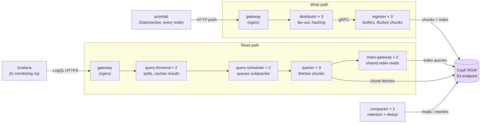
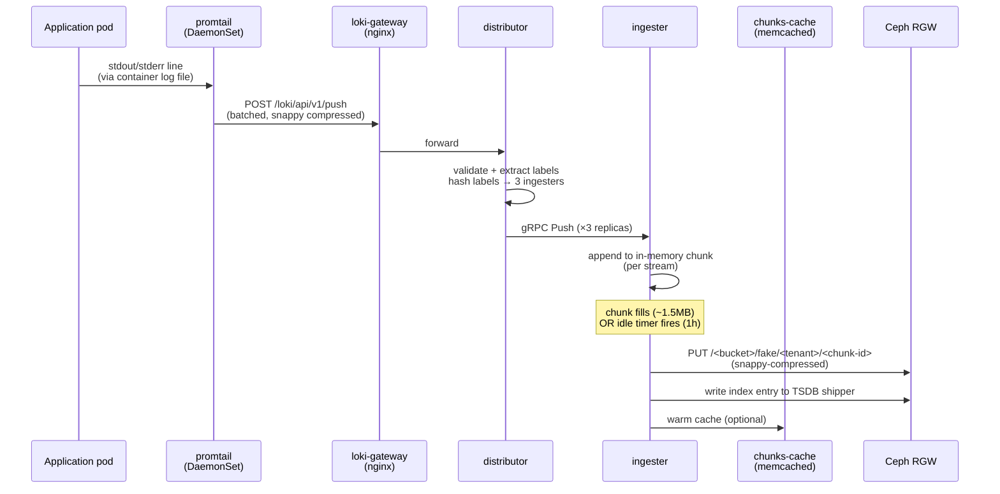
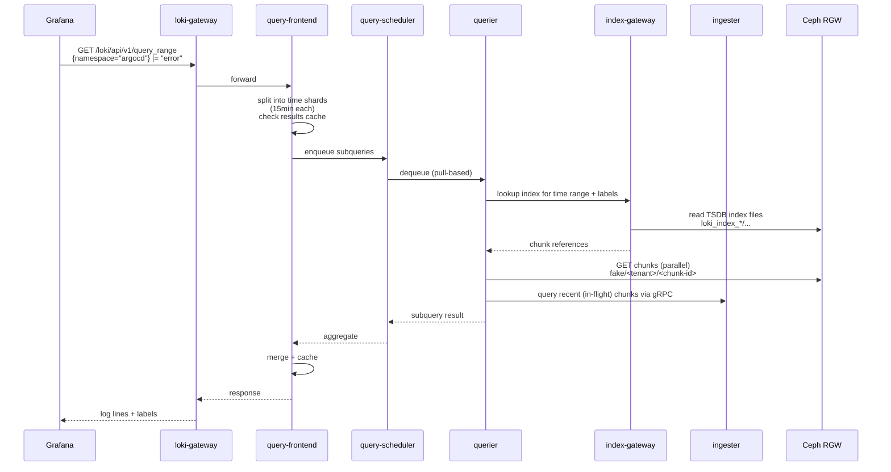

# Loki architecture in this repo

How log lines flow into and out of `home-cluster`'s Loki, and *why* this directory looks the way it does. Companion to [`platform/storage/rook-ceph/ARCHITECTURE.md`](../../../storage/rook-ceph/ARCHITECTURE.md) — Loki is the first real consumer of Ceph S3.

For ArgoCD's render pipeline (Application → repo-server → KSOPS → kustomize → cluster), see [`platform/argocd/ARCHITECTURE.md`](../../../argocd/ARCHITECTURE.md).

---

## Table of contents

1. [What Loki does](#1-what-loki-does)
2. [Distributed mode topology](#2-distributed-mode-topology)
3. [Write path: a log line becomes an S3 chunk](#3-write-path-a-log-line-becomes-an-s3-chunk)
4. [Read path: a Grafana query returns logs](#4-read-path-a-grafana-query-returns-logs)
5. [Storage layout in the bucket](#5-storage-layout-in-the-bucket)
6. [Why one bucket, not three](#6-why-one-bucket-not-three)
7. [Why `-config.expand-env` and OBC env injection](#7-why--configexpand-env-and-obc-env-injection)
8. [Decisions log](#8-decisions-log)

---

## 1. What Loki does

Loki is a horizontally-scalable log aggregation system. Promtail (running as a DaemonSet on every node) tails container logs and ships them to Loki. Loki keeps a hot index in memory, batches log lines into compressed chunks, and persists chunks to object storage. Grafana queries Loki via LogQL.

The deal versus a traditional ELK setup:

| | ELK | Loki |
|---|---|---|
| Index | Inverted full-text index of every word | Only labels indexed; log content kept raw + compressed |
| Storage | Big, expensive, on disk | Small index in S3; bulk chunks in S3 |
| Query model | Search any term | Filter by labels first, then grep within matched chunks |
| Cost | High | Low — chunks are just S3 objects |

So Loki is cheap because it doesn't index everything. The trade-off is that arbitrary text searches across all logs are slower than ELK; you're expected to narrow by labels (namespace, app, level) first.

## 2. Distributed mode topology

The chart supports four deployment modes (`SingleBinary`, `SimpleScalable`, `Distributed`, `SimpleScalable<->Distributed` transition). We run **Distributed** — every microservice runs as its own Deployment/StatefulSet. Trade-off: more pods to operate, but each can scale independently, and a slow component (e.g. compactor) can't impact the write path.



Component cheatsheet:

| Component | Role | Failure impact |
|---|---|---|
| **gateway** | nginx in front of distributors + queriers; speaks Loki HTTP API | All ingest + queries stop |
| **distributor** | Hashes incoming streams to ingesters; replicates 3× by default | Ingest paused; promtail buffers locally and retries |
| **ingester** | Holds the latest hour or so of logs in memory; flushes compressed chunks to S3 | Recent logs unqueryable until the StatefulSet recovers; *unflushed* data is lost if all replicas die at once (we mitigate with replication + WAL) |
| **querier** | Pulls chunks + index from S3 to answer queries | Queries fail; ingest unaffected |
| **query-frontend** | Splits big queries into time-shards; caches results | Queries serial / uncached |
| **query-scheduler** | Queues subqueries → spreads work across queriers | One degrades into bypass mode |
| **index-gateway** | Shared TSDB index reader so each querier doesn't fetch its own | Queriers read S3 directly — slower but works |
| **compactor** | Daily compaction of TSDB index; runs retention deletion | No retention enforcement; storage grows |
| **chunks-cache** (Memcached) | LRU cache of recently-read chunks | Cache misses are slower but correct |

## 3. Write path: a log line becomes an S3 chunk



**Replication factor 3**: every chunk lives in 3 ingesters until flushed. Two ingester deaths still leave one copy. Once flushed to S3, the chunk has Ceph's own 3-way replication on top.

**Chunk encoding**: we use `snappy` (set in `loki.ingester.chunk_encoding`). Faster than gzip on decompress, similar ratio for log text.

## 4. Read path: a Grafana query returns logs



**Two parallel reads**: queriers always check both the persistent S3 chunks AND the live ingesters, because the most recent ~1 hour of logs may not be flushed yet. This is why losing all ingester replicas loses recent data — only S3 chunks are durable.

## 5. Storage layout in the bucket

After the OBC binds, `BUCKET_NAME` resolves to something like `loki-storage-abc12`. Inside the bucket:

```
loki-storage-abc12/
├── fake/
│   └── <tenant_id>/                      # multi-tenant; we use single tenant "fake"
│       └── <hash>/
│           └── <chunk_id>                # compressed log chunk (snappy)
├── loki_index_19851/                     # TSDB index (period prefix from values)
│   └── <period_start_unix>/
│       └── <ingester_or_compactor>/
│           └── *.tsdb.gz
├── rules/
│   └── <tenant_id>/
│       └── <namespace>/
│           └── <rule_group>.yaml         # alerting + recording rules
└── compactor/
    └── delete_requests/                  # tracks pending tombstones
```

**Path collision**: none. `fake/`, `loki_index_<period>/`, `rules/`, `compactor/` never overlap. That's why **one bucket can hold all three "logical buckets" (chunks, ruler, admin) safely** — see next section.

## 6. Why one bucket, not three

The legacy MinIO setup used three separate buckets (`chunks`, `ruler`, `admin`). That worked because MinIO took whatever credentials you gave it and didn't enforce per-bucket ownership.

Ceph's RGW with the rook bucket provisioner is different:

- Each `ObjectBucketClaim` provisions a **new S3 user** (in addition to a new bucket).
- The user owns its bucket and only its bucket.
- Three OBCs ⇒ three users ⇒ three keypairs.

But Loki's helm chart only injects **one** set of credentials via `global.extraEnvFrom`. You can't give Loki three different keypairs and have it pick the right one per bucket — Loki uses a single `aws-sdk-go` S3 client.

Workarounds we considered and rejected:

| Approach | Problem |
|---|---|
| Three OBCs, hand-merge into one Secret | Manual reconciliation; OBC churn breaks it; not GitOps |
| `CephObjectStoreUser` CR + bootstrap Job to `mb` three buckets | Extra moving parts; bootstrap logic to maintain |
| Three OBCs using `bucketName:` (exact) on a shared user | Rook OBCs always create their own user, no "use existing" knob |
| One bucket with logical separation via path prefixes | ✅ Loki already path-separates internally; nothing else changes |

So: **one OBC, one bucket, single set of credentials, Loki uses internal prefixes for the three "logical buckets."** All three of `loki.storage.bucketNames.{chunks,ruler,admin}` are set to `${BUCKET_NAME}` and the path collision check above shows they coexist cleanly.

## 7. Why `-config.expand-env` and OBC env injection

The bucket name comes from `generateBucketName: loki-storage` on the OBC, which means rook adds a 5-char suffix: the actual name is `loki-storage-<hash>`. We can't put that in `values.yaml` because we don't know it until the OBC binds.

Two ways to bridge values to the runtime name:

**Option A — `bucketName: loki` (exact, fixed):** Hardcode a name. Rook treats `bucketName` as **brownfield** (assumes the bucket already exists, won't create it). To bootstrap, we'd run a one-off `radosgw-admin bucket create` or wait for first-write to lazy-create. Either way, more friction.

**Option B — `generateBucketName` + env interpolation:** Let rook own the name. The OBC's emitted `ConfigMap/loki-storage` includes `BUCKET_NAME=<actual>`. We mount it via `extraEnvFrom`, and Loki's `-config.expand-env=true` flag expands `${BUCKET_NAME}` in the rendered config at process start.

**We picked B.** It's fully GitOps — nothing to bootstrap manually, and rook fully owns the bucket lifecycle. Cost is one extra runtime flag (`-config.expand-env=true`, set globally for all components via `global.extraArgs`).

**Why both `secretRef` AND `configMapRef`?** The OBC provisioner splits credentials and metadata:

| Source | Keys |
|---|---|
| `Secret/loki-storage` | `AWS_ACCESS_KEY_ID`, `AWS_SECRET_ACCESS_KEY` |
| `ConfigMap/loki-storage` | `BUCKET_HOST`, `BUCKET_PORT`, `BUCKET_NAME`, `BUCKET_REGION` |

The AWS SDK auto-picks up the credentials from env. `${BUCKET_NAME}` lands via the ConfigMap. Endpoint (`rook-ceph-rgw-ceph-objectstore.rook-ceph.svc:80`) is stable and hardcoded in `values.yaml` since the Service name doesn't change.

## 8. Decisions log

| Decision | Choice | Why not the alternative |
|---|---|---|
| Storage backend | Ceph RGW (S3) | MinIO inside Loki was a single-replica StatefulSet on one PVC = SPOF for all logs; Ceph already replicated 3× across hosts |
| Bucket count | 1 | OBC creates one user per bucket; Loki has one S3 client. See §6. |
| Bucket name source | OBC `generateBucketName` + env interpolation | Hardcoded `bucketName` would be brownfield (rook expects it to pre-exist) |
| Credential source | OBC-emitted Secret via `extraEnvFrom` | SOPS-encrypted static creds = manual rotation, no rook-managed user lifecycle |
| Schema | `tsdb v13` | Already what's running; no migration needed; v13 is the modern default |
| Retention | 7d (in `loki.limits_config`) | Matches existing setup; logs are cheap to re-ship if needed |
| Deployment mode | Distributed | Already what's running; SimpleScalable would force a re-shard of writers/readers and we don't gain anything for our load |
| Replication factor | 3 ingesters with default RF=3 | One ingester loss tolerable; matches current setup |
| Gateway IngressClass | `cilium` | Migrating off the deprecated nginx-ingress-controller; matches kube-prometheus-stack and traefik migrations |
| ProxyProtocol on gateway | Off | Same reasoning as the traefik migration: BGP architecture doesn't pass real client IPs through, and Loki doesn't need them anyway |
| Sync waves | None | Loki tolerates the brief OBC race (S3 retries until bucket exists) — unlike kube-prom-stack where Prometheus pods can't even start without the etcd-cert volume |
| Migration strategy | Cutover (lose <7d) | 7d is the retention anyway; mirroring MinIO → RGW would require a one-shot Job and `mc mirror`, with a state-tracking question (when do we cut over?) — not worth the complexity |
