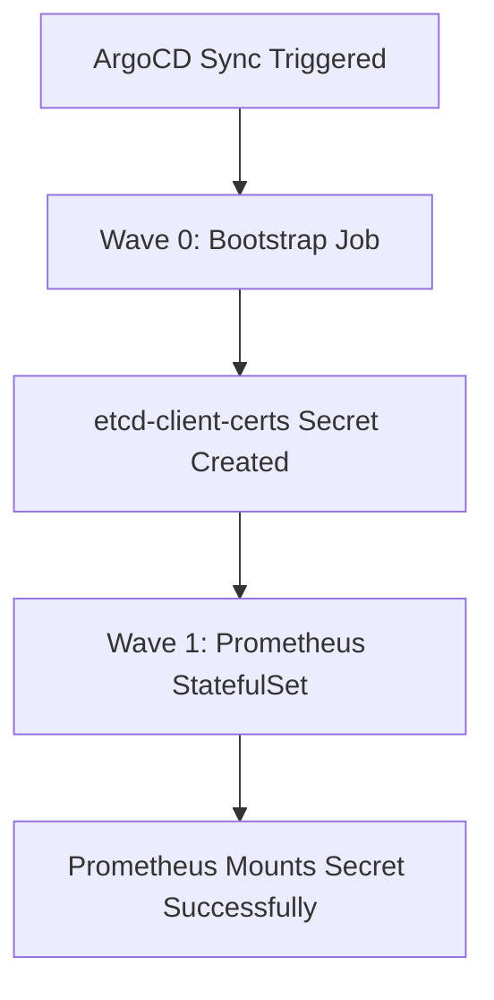

# kube-prometheus-stack

ArgoCD-managed deployment of the Prometheus monitoring stack using the Kustomize-wraps-Helm + KSOPS pattern.

## Overview

This component provides comprehensive Kubernetes monitoring via:
- **Prometheus**: Time-series database and alerting engine
- **Grafana**: Visualization and dashboarding
- **Alertmanager**: Alert routing and notification management  
- **Node Exporter**: Host-level metrics collection
- **kube-state-metrics**: Kubernetes object state metrics
- **Operator**: CRD-based management of Prometheus resources

## Architecture

### Deployment Pattern
- **Base**: Helm chart `kube-prometheus-stack` v82.16.2
- **Customization**: Kustomize overlays with SOPS-encrypted secrets
- **Management**: ArgoCD Application with automated sync
- **Dependencies**: Bootstrap automation for external certificates

### File Structure
```
platform/observability/monitoring/kube-prometheus-stack/
├── application.yaml      # ArgoCD Application definition
├── kustomization.yaml    # Helm chart + KSOPS configuration  
├── values.yaml          # Non-sensitive Helm values
├── secret.enc.yaml      # SOPS-encrypted sensitive values
├── ksops.yaml           # KSOPS generator config
├── etcd-cert-syncer.yaml # Certificate management automation
└── README.md           # This file
```

## Migration History

**Migrated**: 2026-04-28 from Helm-managed to ArgoCD-managed  
**Previous state**: Direct `helm install kube-prometheus-stack`  
**Migration commits**: `58bf457`, `b98794b`, `bb3503d`

### Key Changes During Migration
1. **IngressClass**: Changed from `traefik` to `cilium` for all ingresses
2. **Certificate Management**: Integrated `etcd-cert-syncer` for dynamic etcd client certificates
3. **Bootstrap Automation**: Added initialization Job to eliminate manual intervention
4. **Secret Management**: Split Helm values into plaintext + SOPS-encrypted portions
5. **Ownership Transfer**: Clean handoff from Helm to ArgoCD via `helm uninstall --keep-history`

## Certificate Management

### Problem Solved
Prometheus requires etcd client certificates to scrape etcd metrics from control plane nodes. These certificates are stored on control plane nodes at `/etc/kubernetes/pki/etcd/` but need to be available as a Kubernetes Secret in the `monitoring` namespace.

### Solution Architecture
**Two-tier automation**:

1. **Bootstrap Job** (`etcd-cert-syncer-bootstrap`):
   - **Purpose**: Creates initial `etcd-client-certs` secret on first deployment
   - **Trigger**: ArgoCD sync (runs once per Application deployment)
   - **Sync Wave**: `0` (runs before Prometheus StatefulSet)
   - **Cleanup**: Auto-deletes after 24 hours via `ttlSecondsAfterFinished`

2. **Maintenance CronJob** (`etcd-cert-syncer`):
   - **Purpose**: Refreshes certificates daily (handles cert rotation)
   - **Schedule**: `0 0 * * *` (midnight daily)
   - **Source**: Control plane nodes (`hostPath: /etc/kubernetes/pki/etcd`)
   - **Target**: `monitoring/etcd-client-certs` Secret

### Sync Wave Ordering


**Implementation**:
- Bootstrap Job: `argocd.argoproj.io/sync-wave: "0"`
- Prometheus StatefulSet: `argocd.argoproj.io/sync-wave: "1"` (via `values.yaml`)

## Secret Management

### Encrypted Secrets (`secret.enc.yaml`)
SOPS-encrypted with age key, contains:
- `grafana-admin-password`: Grafana admin user password
- `grafana-admin-username`: Grafana admin username

### External Secrets (Dynamic)
- `etcd-client-certs`: Created by certificate sync automation
  - `etcd-ca`: etcd Certificate Authority
  - `etcd-client`: Client certificate  
  - `etcd-client-key`: Client private key

## Network Configuration

### Ingress Configuration
All ingresses use `ingressClassName: cilium`:

- **Alertmanager**: `alertmanager.prod-cluster.internal.locthp.com`
- **Grafana**: `grafana.prod-cluster.internal.locthp.com`  
- **Prometheus**: `prometheus.prod-cluster.internal.locthp.com`

TLS certificates managed by cert-manager with `cluster-issuer: letsencrypt-prod`.

### Service Monitoring
Configured to scrape:
- **Kubernetes components**: API server, scheduler, controller-manager, etcd, kubelet
- **Platform services**: CoreDNS, Cilium, ingress controllers
- **Application metrics**: Via ServiceMonitor CRDs

## Storage

- **Prometheus TSDB**: 50Gi PVC on Ceph block storage (`ceph-block` StorageClass)
- **Retention**: 15 days (`prometheusSpec.retention: 15d`)
- **Grafana**: ConfigMaps for dashboards, no persistent storage required

## Operations

### Deployment
```bash
# Apply the ArgoCD Application
kubectl apply -f application.yaml

# Monitor bootstrap process  
kubectl get jobs -n monitoring -l app.kubernetes.io/component=etcd-cert-syncer -w

# Check Prometheus startup
kubectl get pods -n monitoring -l app.kubernetes.io/name=prometheus -w
```

### Manual Certificate Refresh (Emergency)
```bash
# Trigger certificate sync immediately
kubectl create job -n monitoring etcd-cert-syncer-manual --from=cronjob/etcd-cert-syncer

# Check secret contents
kubectl get secret -n monitoring etcd-client-certs -o yaml
```

### Troubleshooting

#### Bootstrap Issues
If Prometheus fails with `MountVolume.SetUp failed for volume "secret-etcd-client-certs"`:
1. Check if bootstrap job completed: `kubectl get job -n monitoring etcd-cert-syncer-bootstrap`
2. Verify secret exists: `kubectl get secret -n monitoring etcd-client-certs`
3. Check job logs: `kubectl logs -n monitoring job/etcd-cert-syncer-bootstrap`

#### Certificate Issues  
If etcd metrics are missing:
1. Check certificate expiry: `kubectl get secret -n monitoring etcd-client-certs -o yaml | base64 -d`
2. Manually trigger refresh: `kubectl create job -n monitoring etcd-cert-syncer-manual --from=cronjob/etcd-cert-syncer`
3. Verify control plane node access: Certificate sync requires scheduling on control plane nodes

#### ArgoCD Sync Issues
If Application shows OutOfSync or Degraded:
1. Check for resource conflicts: `kubectl get application -n argocd kube-prometheus-stack -o yaml`
2. Verify KSOPS decryption: `kubectl logs -n argocd -l app.kubernetes.io/name=argocd-repo-server -c ksops`
3. Force refresh: `kubectl -n argocd patch application kube-prometheus-stack --type merge -p '{"operation":{"sync":{"syncStrategy":{"hook":{},"apply":{"force":false}}}}}'`

## Configuration Customization

### Adding Helm Values
Edit `values.yaml` for non-sensitive overrides:
```yaml
prometheus:
  prometheusSpec:
    retention: 30d  # Extend retention
    resources:
      requests:
        memory: 2Gi   # Adjust memory
```

### Adding Secrets
Edit `secret.enc.yaml` (requires SOPS):
```bash
# Edit encrypted secrets
sops secret.enc.yaml

# Re-encrypt after changes
sops -e -i secret.enc.yaml
```

### Service Monitor Examples
Add custom monitoring via ServiceMonitor CRDs in the Helm values or as additional Kustomize resources.

## Related Documentation

- **Migration Case Study**: [`platform/argocd/LESSONS.md`](../../argocd/LESSONS.md) - Full migration walkthrough with challenges and solutions
- **ArgoCD Architecture**: [`platform/argocd/ARCHITECTURE.md`](../../argocd/ARCHITECTURE.md) - How ArgoCD + KSOPS + Kustomize works
- **Platform Conventions**: [`platform/CLAUDE.md`](../../CLAUDE.md) - General patterns and adoption workflow
- **Bootstrap Pattern**: Apply this certificate sync approach to other components requiring external dependencies

## References

- **Upstream Helm Chart**: [prometheus-community/kube-prometheus-stack](https://github.com/prometheus-community/helm-charts/tree/main/charts/kube-prometheus-stack)
- **ArgoCD Sync Waves**: [Official Documentation](https://argo-cd.readthedocs.io/en/stable/user-guide/sync-waves/)
- **SOPS Documentation**: [Mozilla/sops](https://github.com/mozilla/sops)
- **KSOPS Plugin**: [viaduct-ai/kustomize-sops](https://github.com/viaduct-ai/kustomize-sops)