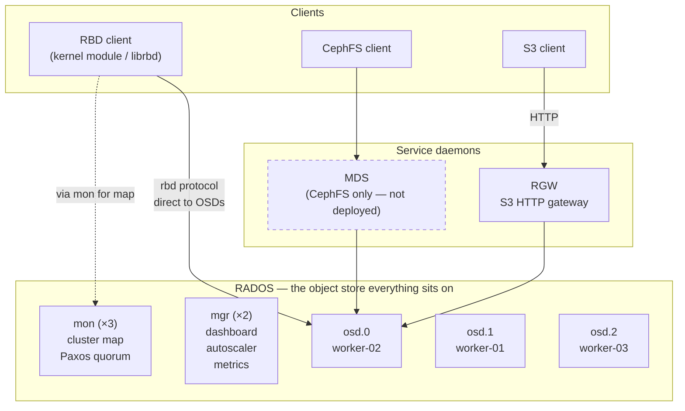
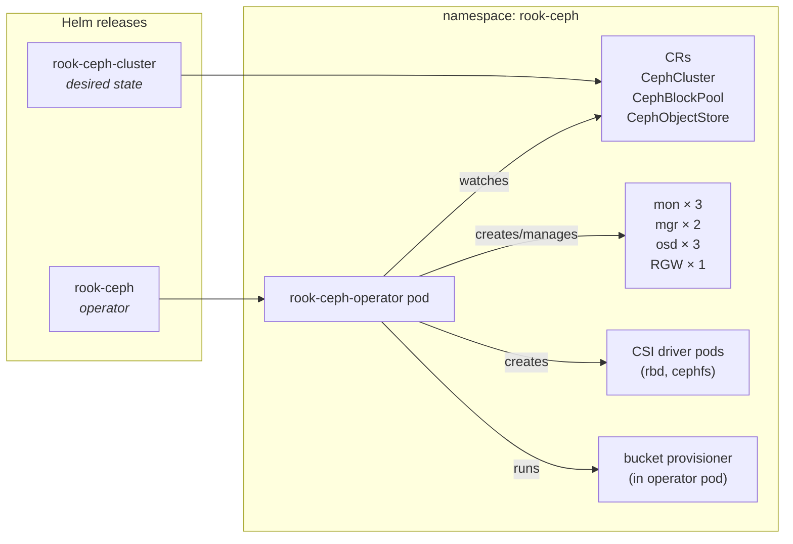
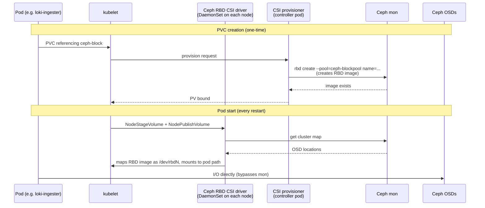
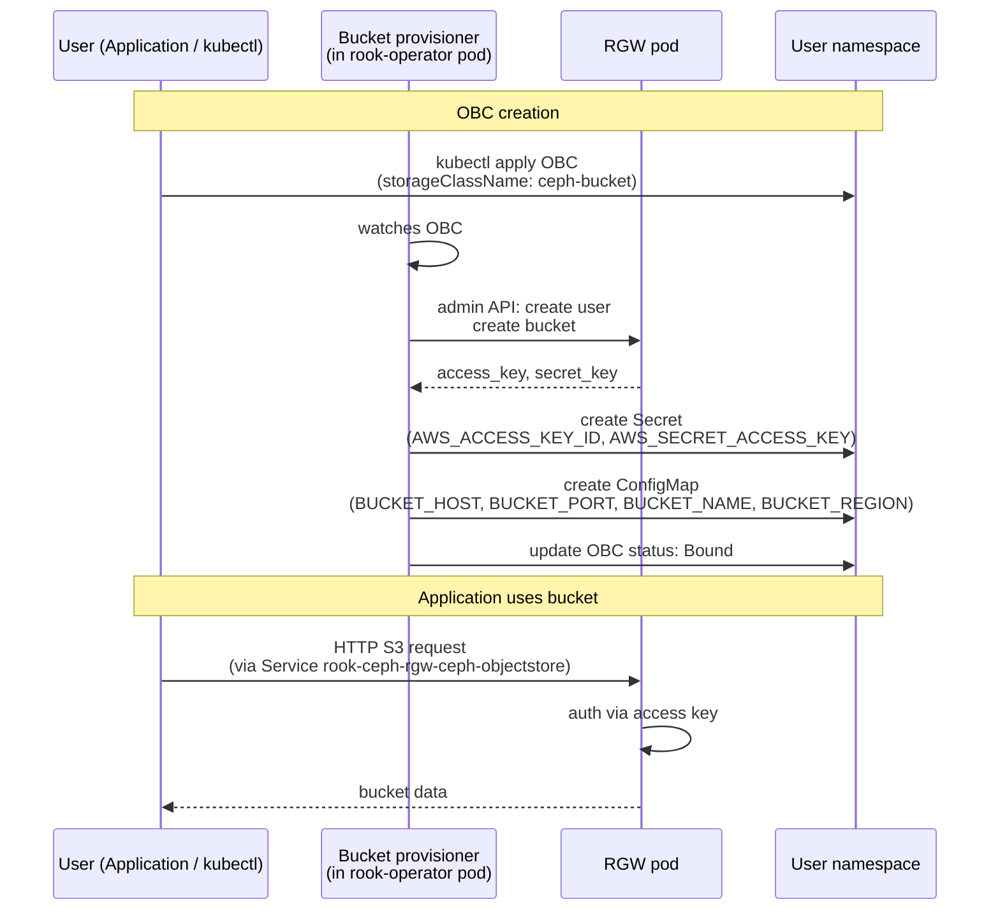

# Rook-Ceph architecture in this repo

A learning-oriented walkthrough of how storage works in `home-cluster`. Covers the Ceph mental model, what Rook does on top, and the request path for both block (RBD) and object (RGW S3) storage. Read this when you want to understand *why* the values in `cluster/values.yaml` look the way they do.

For day-to-day operations, see [`README.md`](./README.md).

---

## Table of contents

1. [Why Ceph](#1-why-ceph)
2. [Core Ceph concepts](#2-core-ceph-concepts)
3. [How Rook fits in](#3-how-rook-fits-in)
4. [What's deployed in this cluster](#4-whats-deployed-in-this-cluster)
5. [Pools, replication, and CRUSH](#5-pools-replication-and-crush)
6. [Request path: how a PVC becomes a block device](#6-request-path-how-a-pvc-becomes-a-block-device)
7. [Request path: how an OBC becomes an S3 bucket](#7-request-path-how-an-obc-becomes-an-s3-bucket)
8. [Why the choices we made](#8-why-the-choices-we-made)
9. [Glossary](#9-glossary)

---

## 1. Why Ceph

Kubernetes stateful workloads need durable storage that survives pod rescheduling. The naive option — `hostPath` — pins a pod to one node and dies with that node. The realistic options are:

- A managed cloud storage service (EBS, Persistent Disk). Not available on bare metal.
- An NFS server. Single point of failure unless you build HA yourself.
- A distributed storage system that replicates data across nodes. **This is Ceph.**

Ceph gives us three storage interfaces from the same physical disks:

| Interface | API | Used for |
|---|---|---|
| **RBD** (RADOS Block Device) | Block volumes — Kubernetes PVCs | StatefulSet PVCs (loki, prometheus, …) |
| **CephFS** | POSIX filesystem | Not used here yet |
| **RGW** (RADOS Gateway) | S3 / Swift HTTP API | Loki object storage, future tfstate, registries |

All three sit on top of the same underlying replicated object store (RADOS), so every byte you write is replicated 3× across hosts regardless of which interface produced it.

## 2. Core Ceph concepts



The pieces, smallest to largest:

- **Object** — Ceph stores everything as named blobs in a flat namespace. A 4 GiB RBD volume is just thousands of 4 MiB objects. A 1 TiB S3 file is many objects. *Object* here means RADOS object, not S3 object — the S3 API translates its objects into RADOS objects internally.
- **OSD (Object Storage Daemon)** — One per physical disk (or LVM volume). The OSD owns its disk and talks RADOS protocol. Reads and writes hit OSDs directly. We have **3 OSDs**, one per worker node, all HDD.
- **PG (Placement Group)** — A bucket of objects. Ceph hashes each object name to a PG, then maps each PG to a set of OSDs (the "acting set"). The PG layer is what makes scaling tractable: you don't track replication per-object, you track it per-PG. PG count auto-scales via the `pg_autoscaler` mgr module.
- **Pool** — A logical group of PGs with a replication policy (`size 3`, etc.) and a CRUSH rule. RBD images live in a pool. RGW data lives in another pool. Pools are how you say *"this data is replicated 3×, that data is erasure coded."*
- **Mon (Monitor)** — Holds the cluster map (which OSDs exist, which are up, which PGs map where). Paxos-replicated, **odd count for quorum** (we run 3). Clients ask a mon once at startup, then talk OSDs directly.
- **Mgr (Manager)** — The "control plane brain." Hosts the dashboard, exposes Prometheus metrics, runs the `pg_autoscaler` and `balancer` modules. Two replicas, only one active at a time. Losing the mgr doesn't break I/O — it breaks observability and the autoscaler.
- **CRUSH (Controlled Replication Under Scalable Hashing)** — The placement algorithm. Given a PG and the cluster map, CRUSH deterministically computes which OSDs should hold its replicas. *No central metadata server* — every client computes the same answer from the map. This is what makes Ceph scale.
- **Failure domain** — The unit CRUSH refuses to place two replicas in. With `failureDomain: host` and 3 hosts, the 3 replicas of every PG land on 3 different hosts. With `failureDomain: osd`, replicas could land on the same host (worse).

## 3. How Rook fits in

Plain Ceph is operated with `ceph-deploy` / `cephadm` / Ansible. Rook is a Kubernetes operator that runs Ceph **inside** the cluster:

- The Rook operator pod watches the `CephCluster` / `CephBlockPool` / `CephObjectStore` / `CephFilesystem` CRs. When you create or change one, the operator launches/configures the appropriate Ceph daemons as Pods.
- The operator also runs the **Ceph CSI driver**, so PVCs that reference a Ceph StorageClass get provisioned automatically as RBD images or CephFS subvolumes.
- The operator runs the **bucket provisioner** — when you create an `ObjectBucketClaim`, Rook creates a bucket on the named `CephObjectStore` and emits a Secret + ConfigMap with credentials and endpoint into your namespace.

Why two helm releases? The operator (`rook-ceph`) is the thing that *runs the operator*. The cluster (`rook-ceph-cluster`) is the thing that *declares the desired state* (CephCluster + pools + object stores). Splitting them lets you upgrade the operator without restarting all the daemons, and lets you shape the cluster without touching the operator deployment.



## 4. What's deployed in this cluster

Run-time inventory (verify with `kubectl get pods -n rook-ceph` + `ceph status`):

| Component | Count | Where | Purpose |
|---|---|---|---|
| Operator | 1 | `rook-ceph` ns | Reconciles CRs, runs CSI + bucket provisioner |
| Mon | 3 (a, b, d) | one per worker | Cluster map; Paxos quorum requires majority alive |
| Mgr | 2 (active + standby) | any worker | Dashboard, metrics, autoscaler |
| OSD | 3 (osd.0/1/2) | one per worker, all HDD | Stores actual data |
| RGW | 1 | any worker | S3 gateway (after this PR's `helm upgrade`) |
| Toolbox | 1 | any worker | Pod with `ceph` CLI for ops |

**Pools** (after RGW provisioning lands):

| Pool | Type | size | failureDomain | Purpose |
|---|---|---|---|---|
| `.mgr` | replicated | 3 | host | Mgr internal data (autoscaler, dashboard state) |
| `ceph-blockpool` | replicated | 3 | host | All RBD volumes (PVCs) |
| `ceph-objectstore.rgw.control` | replicated | 3 | host | RGW control |
| `ceph-objectstore.rgw.meta` | replicated | 3 | host | RGW metadata |
| `ceph-objectstore.rgw.log` | replicated | 3 | host | RGW operation log |
| `ceph-objectstore.rgw.buckets.index` | replicated | 3 | host | Bucket index (filename → object) |
| `ceph-objectstore.rgw.buckets.non-ec` | replicated | 3 | host | Multipart upload state |
| `ceph-objectstore.rgw.otp` | replicated | 3 | host | One-time passwords (multifactor S3 ops) |
| `ceph-objectstore.rgw.buckets.data` | replicated | 3 | host | **Actual S3 object data** |

The RGW creates ~7–8 metadata pools per object store automatically — that's not bloat, it's how RGW separates concerns. They're tiny (KB to MB) except for `.buckets.index` (proportional to object count) and `.buckets.data` (proportional to total bytes).

**StorageClasses** (after this PR):

| StorageClass | Provisioner | Backed by | Used by |
|---|---|---|---|
| `ceph-block` *(default)* | `rook-ceph.rbd.csi.ceph.com` | `ceph-blockpool` | All PVCs |
| `ceph-bucket` | `rook-ceph.ceph.rook.io/bucket` | `ceph-objectstore` | All ObjectBucketClaims |

## 5. Pools, replication, and CRUSH

### Replicated vs. erasure coded

A pool stores each object multiple ways:

- **Replicated `size: N`** — store the object N times. Reads are fast (any replica answers). Writes are slow (must ack on all replicas). Storage overhead = N×.
- **Erasure coded `k+m`** — split the object into k data chunks + m parity chunks (think RAID-6 but generalized). Reads are slower (reassemble from chunks). Writes are CPU-heavy. Storage overhead = `(k+m)/k`× — much cheaper.

For a 3-OSD cluster with `failureDomain: host`, only EC profile `k=2, m=1` is even placeable, and that profile = essentially RAID-5 across hosts. Lose 1 host → zero redundancy. Lose 1 host *during recovery* → data loss. Replicated 3 keeps 2 copies after losing 1 host. **EC starts paying off at 5+ hosts and dedicated CPU; for our 3-host HDD cluster, replicated 3 is the only safe choice.**

### Failure domains

`failureDomain: host` tells CRUSH "no two replicas on the same host." With 3 hosts × 1 OSD each, the 3 replicas of every PG land on 3 different hosts. If we had 2 OSDs per host, we'd want `failureDomain: host` (not `osd`) to ensure the same.

### `min_size`

`min_size: 2` means the pool refuses writes if fewer than 2 replicas are reachable. Lose 1 host → pool keeps serving (2 copies remain). Lose 2 hosts → pool stops accepting writes (data is read-only / I/O hangs) until a host returns. This is intentional — it prevents the cluster from accepting writes that can only be saved in one place.

### CRUSH map

You can inspect it from the toolbox:

```bash
kubectl --context home-cluster -n rook-ceph exec deploy/rook-ceph-tools -- ceph osd tree
```

Returns a tree like `root → host → osd`. CRUSH walks this tree to pick replicas under the `failureDomain`.

## 6. Request path: how a PVC becomes a block device



Key thing: **clients do not route I/O through the mon or operator.** The mon is consulted once for the map, then the client computes which OSDs hold the data and talks to them directly. This is why Ceph scales — there is no central data path bottleneck.

## 7. Request path: how an OBC becomes an S3 bucket



The OBC contract: when you create an OBC named `loki-chunks` in the `logging` namespace, you get back:

- `Secret/loki-chunks` with keys `AWS_ACCESS_KEY_ID` and `AWS_SECRET_ACCESS_KEY`.
- `ConfigMap/loki-chunks` with keys `BUCKET_HOST`, `BUCKET_PORT`, `BUCKET_NAME`, `BUCKET_REGION`.

The `BUCKET_NAME` is auto-generated like `loki-chunks-<5char-hash>` so you can't predict it before the OBC binds. That's why workloads point at it via the ConfigMap, not a hardcoded string.

`BUCKET_HOST` resolves to the in-cluster RGW Service (`rook-ceph-rgw-ceph-objectstore.rook-ceph.svc`), reachable on plain HTTP port 80 from any pod.

## 8. Why the choices we made

| Decision | What we chose | Why not the alternative |
|---|---|---|
| Replicated vs erasure coded | Replicated, size 3 | EC unsafe at 3 hosts (only k=2,m=1 places, and that loses redundancy on first failure) |
| Failure domain | `host` | `osd` would let 2 replicas land on the same host = lose host = lose data |
| Mon count | 3 | Paxos quorum requires majority; 1 = no HA, 5 = waste, 3 = standard |
| Mgr count | 2 | One active, one standby. Mgr loss doesn't break I/O, just metrics. |
| RGW instances | 1 | Operator reschedules on failure; can scale up later if throughput is the bottleneck |
| RGW gateway TLS | Plain HTTP, port 80 | TLS terminates at the cilium Ingress when external access is added. Two TLS termination points = two cert renewal paths. |
| `preservePoolsOnDelete: true` | Yes | If the `CephObjectStore` CR ever gets deleted (sync misfire), the underlying pools stay so we don't lose all object data |
| MDS / CephFS | Not deployed | RBD covers PVC needs; nothing in the cluster currently needs ReadWriteMany |

## 9. Glossary

| Term | Meaning |
|---|---|
| RADOS | The underlying object store. Everything in Ceph is "stuff stored in RADOS." |
| OSD | Object Storage Daemon — one per disk, owns reads/writes for objects on that disk |
| Mon | Monitor — keeps the cluster map, Paxos-replicated |
| Mgr | Manager — dashboard, autoscaler, metrics, balancer |
| MDS | Metadata Server — only for CephFS (not used here) |
| RGW | RADOS Gateway — translates S3/Swift HTTP into RADOS operations |
| RBD | RADOS Block Device — exposes an RADOS pool as block devices to Linux |
| PG | Placement Group — bucket of objects; the unit of replication |
| CRUSH | Placement algorithm — deterministically maps PGs to OSDs given the cluster map |
| Pool | Logical group of PGs with a replication policy |
| OBC | ObjectBucketClaim — Kubernetes CR that requests a bucket on a CephObjectStore |
| OB | ObjectBucket — cluster-scoped CR backing the OBC, similar to PV ↔ PVC |
| Toolbox | A pod with the `ceph` CLI installed for cluster admin |
